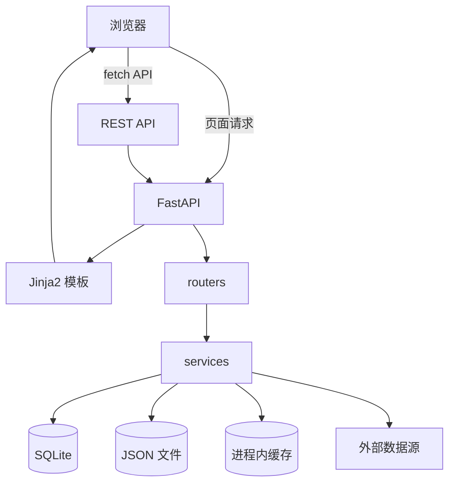
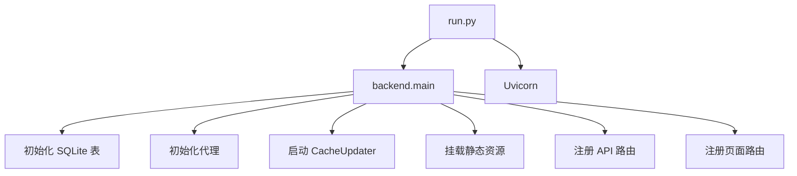
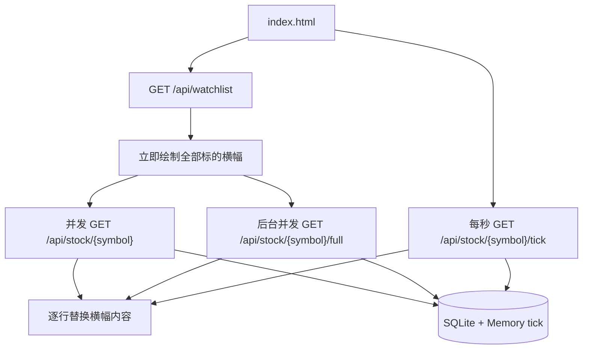
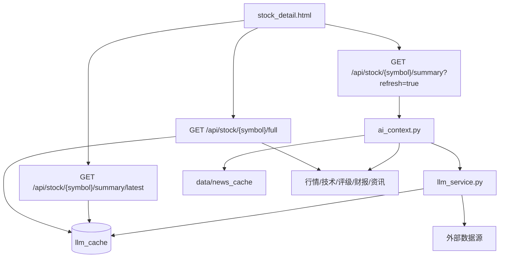
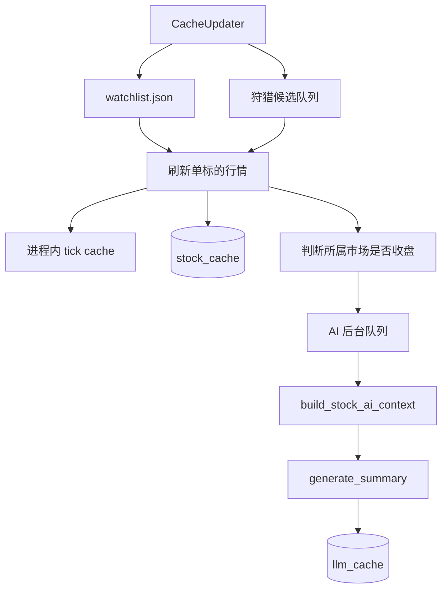
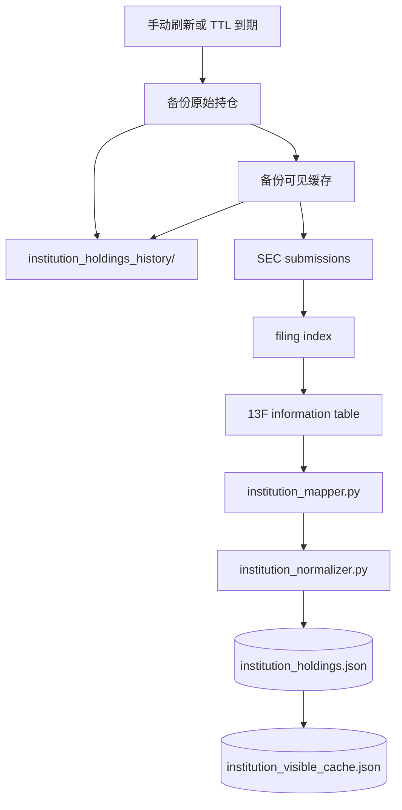

# StockTracing 架构与工作流程

## 总览

StockTracing 是一个本地单体 FastAPI 应用。前端使用 Jinja2 模板，页面交互通过 `fetch('/api/...')` 调用后端 REST API。数据以 SQLite、JSON 文件和进程内缓存混合存储。



## 页面结构

| 页面 | 路径 | 模板 | 说明 |
|---|---|---|---|
| 仪表盘 | `/` | `index.html` | 自选股渐进式横幅、主要股指、市场时刻表、实时 tick |
| 个股详情 | `/stock/{symbol}` | `stock_detail.html` | 概览、图表、技术、评级、财报、资讯、AI |
| 技术扫描 | `/scan` | `scan.html` | 自选股技术矩阵和 AI 信号刷新 |
| 狩猎 | `/hunt` | `hunt.html` | 多市场候选扫描和四维评分 |
| 机构持仓 | `/institutions` | `institutions.html` | SEC 13F 机构持仓跟踪 |
| 交易记录 | `/trades` | `trades.html` | 交易 CRUD 和盈亏统计 |
| 持仓分析 | `/portfolio` | `portfolio.html` | 组合持仓、占比和收益曲线 |

## 核心流程图

### 应用启动



### 仪表盘渐进式加载



### 个股详情与 AI



### 后台缓存与收盘后 AI



### 机构持仓刷新



## 路由层

`backend/routers/pages.py` 提供页面路由。

`backend/routers/stock.py` 提供主要 REST API：

| API | 说明 |
|---|---|
| `/api/stock/{symbol}` | 股票或加密货币基础信息，优先缓存 |
| `/api/stock/{symbol}/tick` | 实时 tick、sparkline、盘前/盘后字段 |
| `/api/stock/{symbol}/history` | 历史 K 线 |
| `/api/stock/{symbol}/technical` | 技术指标 |
| `/api/stock/{symbol}/periods` | D/W/M/Y 周期涨跌和信号 |
| `/api/stock/{symbol}/news` | 读取上次资讯缓存 |
| `/api/stock/{symbol}/news?refresh=true` | 手动刷新资讯 |
| `/api/stock/{symbol}/summary/latest` | 只读最新 AI 缓存 |
| `/api/stock/{symbol}/summary?refresh=true` | 手动刷新资料并生成 AI 分析 |
| `/api/stock/{symbol}/full` | 个股详情聚合数据，只读取 AI 缓存 |
| `/api/watchlist` | 自选股读取、添加、删除 |
| `/api/hunt/*` | 狩猎市场、扫描、历史 |
| `/api/institutions` | 机构持仓首屏可见缓存 |
| `/api/institutions/{id}` | 单机构完整持仓详情 |
| `/api/institutions/history` | 机构持仓历史列表 |
| `/api/institutions/history/{id}` | 历史快照详情 |
| `/api/institutions/warm-mappings` | CUSIP/ticker 映射预热 |
| `/api/trades/*` | 交易记录、统计、组合分析 |
| `/api/config` | LLM 和代理配置 |

## 服务层

### 行情与缓存

`stock_data.py` 负责股票基础信息、实时 tick、历史 K 线、A 股代码后缀解析和 tick sparkline。`get_tick()` 会优先读取 `CacheUpdater` 的进程内 tick cache，缺失时再请求外部数据。

`cache_updater.py` 是后台缓存线程，周期刷新自选股和狩猎候选标的，写入 `stock_cache` 和进程内 tick cache。它还维护独立 AI 后台队列，在对应市场收盘后为每个标的每天刷新一次 AI 缓存，避免阻塞前端访问。

扩展时段价格由 `preMarketPrice`、`postMarketPrice` 和 `marketState` 共同判断。前端只展示当前有效的盘前或盘后数据，避免旧盘后价残留到下一次盘前。

### 技术、评级和财报

`technical.py` 计算 SMA、EMA、MACD、RSI、Bollinger、ATR、OBV、Stochastic，并输出综合信号和 D/W/M/Y 周期分析。

`analyst.py` 读取目标价、评级、近期评级和调级记录。

`financials.py` 读取年度和季度利润表、资产负债表和现金流量表，并写入 `financial_cache`。

### AI 与资讯

`news_service.py` 聚合 Yahoo Finance 和 DuckDuckGo 资讯。普通读取只返回上次缓存，手动刷新才会联网更新。

`ai_context.py` 负责整理 AI 输入资料，包括基本信息、近期资讯、D/W/M/Y 涨跌和信号、技术指标、机构评级、营收和财务摘要。它会压缩字段，避免把完整原始对象直接传给 LLM。

`llm_service.py` 调用 OpenAI 兼容 API，使用 prompt hash 写入 `llm_cache`。AI 输出会提取 `买入`、`观望` 或 `卖出` 信号。JSON 序列化支持 `datetime` 和类似 `Timestamp` 的对象。

AI 的设计原则：

```text
仪表盘 / 个股详情初始加载 -> 只读 AI 缓存
手动刷新 AI -> 强制刷新资料和资讯，再生成 AI
后台收盘任务 -> 顺序刷新 AI 缓存，不阻塞前端
技术扫描 -> 开始扫描时逐个刷新 AI 并显示信号
```

### 加密货币

`crypto.py` 支持实时行情、OHLCV、D/W/M/Y 周期和技术指标。

数据源回退：

```text
ccxt Binance -> ccxt OKX -> Binance HTTP -> OKX HTTP
```

### 狩猎

`discovery.py` 构建市场候选集。

`hunter.py` 按价值、机构、技术、财务四维评分，并写入 `hunt_session` 历史。

### 交易与持仓

`trades.py` 管理交易记录、盈亏统计、持仓合并、领域占比和收益曲线。

交易记录存储在 `data/trades.json`。

## 机构持仓子系统

机构持仓由三个服务协作：

```text
institutions.py
institution_mapper.py
institution_normalizer.py
```

`institutions.py` 负责机构元数据、SEC 13F 拉取、8 小时 TTL、刷新前备份、当前可见缓存、历史列表和历史详情。

`institution_mapper.py` 负责 CUSIP、issuer name、ticker directory 和 sector 映射。映射顺序包含手工高权重映射、SEC company tickers、SEC exchange directory、NASDAQ directory、本地 cache 和 OpenFIGI 兜底。

`institution_normalizer.py` 负责 ticker 清洗、issuer 归一化、PUT/CALL 标记、证券类型识别、同标的多行合并、历史增减持对比和前端展示字段生成。

首屏读取：

```text
GET /api/institutions
  ↓
institution_visible_cache.json
  ↓
机构横幅、前十资产、领域占比
```

展开机构：

```text
GET /api/institutions/{id}
  ↓
该机构完整 holdings
```

历史查看：

```text
GET /api/institutions/history/{snapshot}
  ↓
优先读取 institution_visible_{snapshot}.json
  ↓
缺失时由 institution_holdings_{snapshot}.json 构建并回写
```

## 存储层

### SQLite

数据库：`data/stocktracing.db`

| 表 | 作用 |
|---|---|
| `stock_cache` | 股票基础信息、估值、目标价、实时字段 |
| `financial_cache` | 财报缓存 |
| `analysis_cache` | 技术指标、K 线、评级等分析缓存 |
| `llm_cache` | AI 分析缓存和历史 |
| `hunt_session` | 狩猎扫描历史 |

### JSON 文件

| 文件 | 作用 |
|---|---|
| `config.json` | LLM 和代理配置 |
| `watchlist.json` | 自选股 |
| `trades.json` | 交易记录 |
| `institution_holdings.json` | 当前机构持仓完整数据 |
| `institution_visible_cache.json` | 当前机构持仓首屏冷缓存 |
| `institution_holdings_history/` | 机构持仓历史快照 |
| `cusip_mapping_cache.json` | CUSIP 映射缓存 |
| `sec_ticker_cache.json` | SEC ticker 主目录缓存 |
| `sec_ticker_exchange_cache.json` | SEC ticker exchange 缓存 |
| `nasdaq_directory_cache.json` | NASDAQ directory 缓存 |
| `ticker_sector_cache.json` | ticker 行业缓存 |
| `news_cache/` | 资讯缓存 |

## 文件列表

```text
StockTracing/
  run.py
    应用启动入口，启动 uvicorn 并加载 backend.main:app。

  requirements.txt
    Python 依赖列表。

  README.md
    项目说明文档。

  ARCHITECTURE.md
    架构、数据流、模块职责和文件说明。

  backend/
    main.py
      FastAPI 应用装配入口。
      初始化数据库、代理、后台缓存线程、静态资源、API 路由和页面路由。

    config.py
      全局配置、路径、代理、LLM 和缓存参数。

    routers/
      pages.py
        页面路由。
      stock.py
        REST API 主路由。

    services/
      ai_context.py
        AI 输入资料整理。
      analyst.py
        机构评级和目标价。
      cache_updater.py
        后台行情缓存、tick cache 和收盘后 AI 队列。
      crypto.py
        加密货币行情和指标。
      discovery.py
        多市场候选集发现。
      financials.py
        财报读取和缓存。
      hunter.py
        狩猎评分。
      institution_mapper.py
        CUSIP/ticker/directory/sector 映射。
      institution_normalizer.py
        机构持仓标准化和增减持计算。
      institutions.py
        SEC 13F 拉取、冷缓存、历史快照和机构 API 数据组装。
      llm_service.py
        LLM 调用、缓存、AI 信号提取和输出截断标记。
      news_service.py
        资讯读取、缓存和手动刷新。
      stock_data.py
        股票基础信息、历史 K 线、tick 和扩展时段行情。
      technical.py
        技术指标和周期信号。
      trades.py
        交易记录、持仓聚合和组合收益。

    database/
      models.py
        SQLAlchemy 模型。

    utils/
      proxy.py
        代理参数生成。
      watchlist.py
        自选股 JSON 读写。

  frontend/
    templates/
      base.html
        全局模板、导航、主题样式和公共 JS。
      index.html
        仪表盘、渐进式横幅、主要股指、时刻表和 tick 刷新。
      stock_detail.html
        个股详情、资讯缓存读取、AI 手动刷新和 AI 历史。
      scan.html
        技术扫描和 AI 信号刷新。
      hunt.html
        狩猎扫描页面。
      institutions.html
        机构持仓横幅、详情展开、刷新进度和历史快照。
      trades.html
        交易记录页面。
      portfolio.html
        持仓分析页面。

  data/
    stocktracing.db
      SQLite 数据库。
    config.json
      本地配置。
    watchlist.json
      自选标的。
    trades.json
      交易记录。
    news_cache/
      标的资讯缓存。
    institution_holdings.json
      当前机构持仓完整数据。
    institution_visible_cache.json
      当前机构持仓首屏摘要缓存。
    institution_holdings_history/
      机构持仓历史快照。
    *_cache.json
      CUSIP、ticker、directory、sector 等映射缓存。

  images/
    README 或演示资源。
```

## 性能策略

- 仪表盘先画横幅，再填缓存，再后台并发补全 `/full` 数据。
- `/api/stock/{symbol}/full` 只读取 AI 缓存，不触发 LLM 生成。
- AI 生成只在手动刷新、技术扫描或收盘后台任务中触发。
- 资讯普通读取只返回旧缓存，手动刷新才联网。
- tick 数据优先使用进程内缓存，并以 1 秒轮询更新前端价格。
- 机构持仓首屏读取冷缓存，详情按机构懒加载。
- CUSIP/ticker/sector 映射缓存化，避免首屏批量请求外部 API。

## 外部依赖风险

| 外部源 | 风险 | 处理 |
|---|---|---|
| Yahoo Finance | 500、限流、HTML 错误页、扩展时段字段不稳定 | 缓存优先、异常捕获、扩展时段字段兜底 |
| SEC EDGAR | 请求频率限制 | User-Agent、8h TTL、冷缓存 |
| OpenFIGI | 免费限流 | 本地缓存和失败回退 |
| Binance/OKX | 网络受限 | 代理和多源回退 |
| LLM API | key 缺失、限流、输出截断 | 可选启用、缓存、输出截断标记 |

## 后续优化方向

- 仪表盘 `/full` 聚合接口拆分成更细的缓存优先接口。
- 机构详情分页或虚拟滚动。
- SEC 刷新任务后台化并支持实时进度。
- 机构持仓从 JSON 迁移到 SQLite 表。
- AI 后台任务增加持久队列和失败重试记录。
