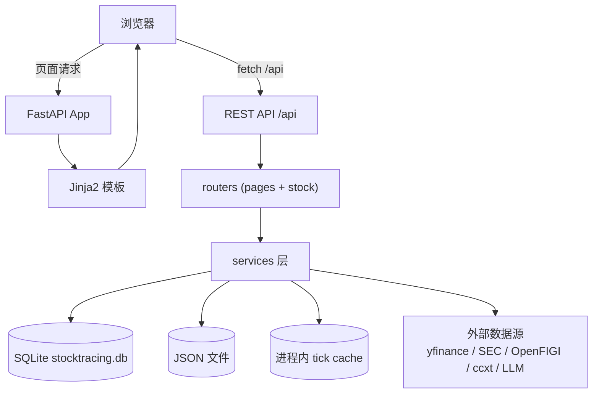
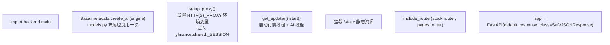
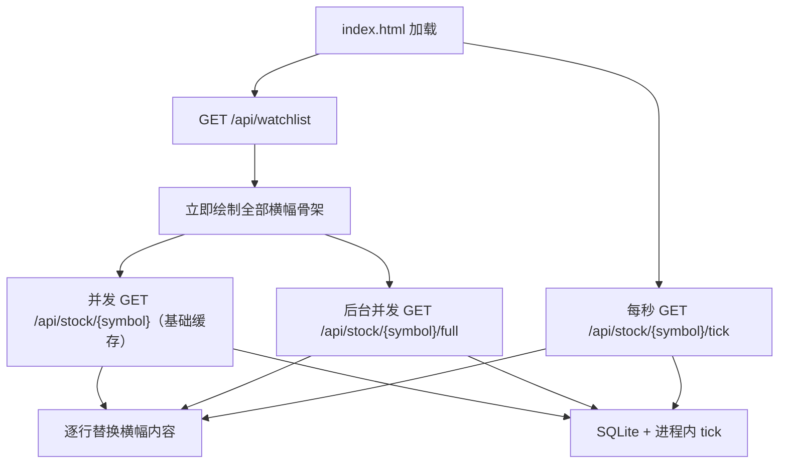
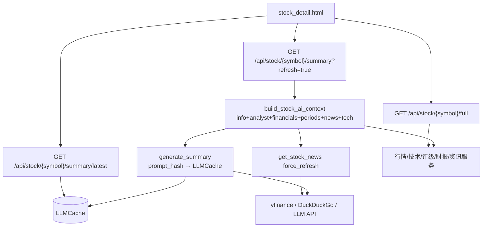
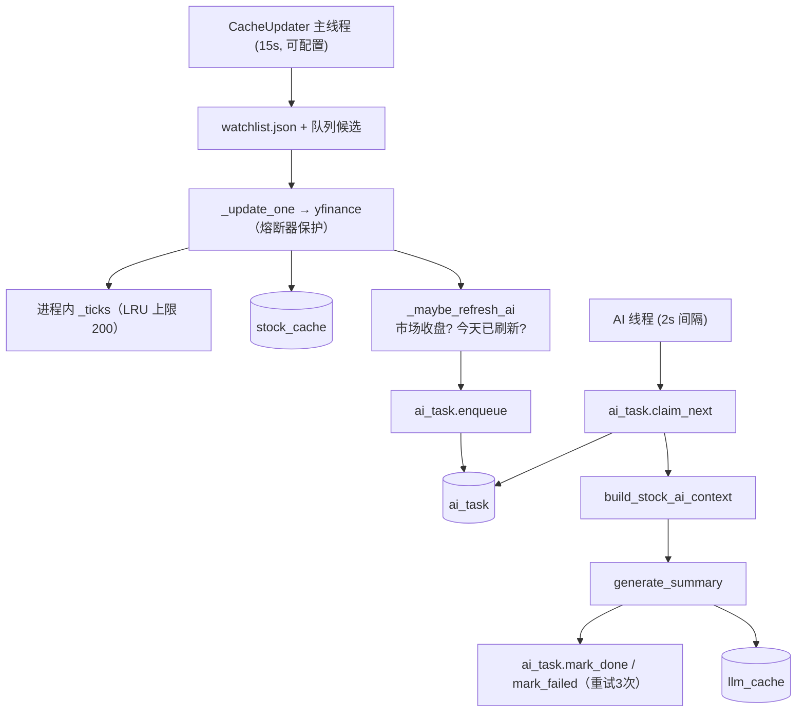
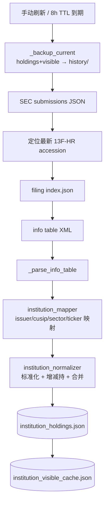
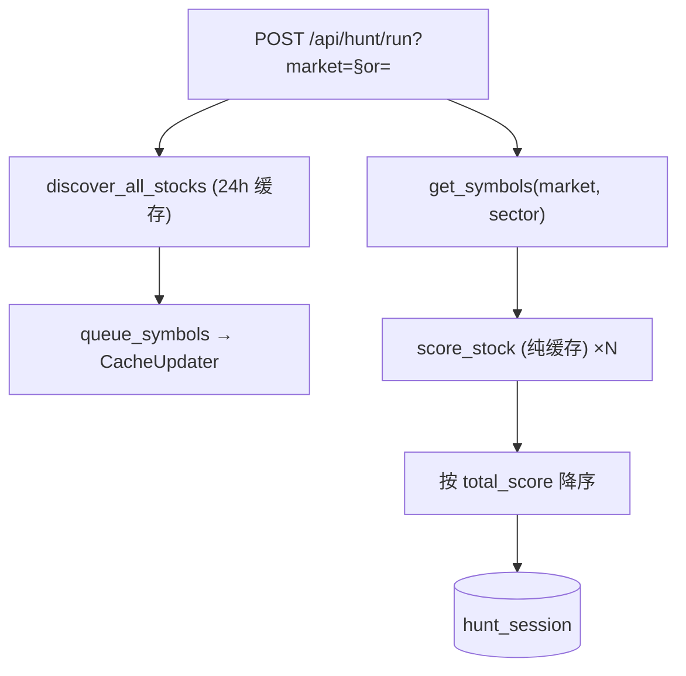
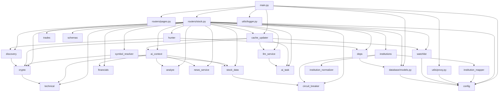

# StockTracing 架构文档

> 本文基于对全部源码的逐文件阅读整理，描述系统的整体结构、模块职责、数据流、存储模型与运行机制。

## 1. 总览

StockTracing 是一个**本地单体 FastAPI 应用**，面向个人投资者，提供自选追踪、技术分析、AI 研报、机构持仓、交易日志与组合分析等功能。

- **后端**：FastAPI + SQLAlchemy + yfinance + ccxt + OpenAI 兼容 LLM
- **前端**：Jinja2 服务端模板 + Tailwind CSS（CDN）+ Chart.js（CDN），无构建步骤，所有 JS/CSS 内联在模板中
- **存储**：SQLite（行情/财报/分析/AI/狩猎历史/AI 任务队列）+ JSON 文件（配置/自选/交易/机构持仓）+ 进程内缓存（tick，LRU 上限 200）
- **并发**：后台守护线程负责行情刷新（15s 间隔，可配置）与收盘后 AI 生成（持久队列，重启不丢）
- **容错**：熔断器（yfinance/SEC）、限流重试、缓存回退、日志观测
- **校验**：Pydantic 请求模型、symbol 解析下沉



## 2. 技术栈与依赖

| 类别 | 选型 |
|---|---|
| Web 框架 | FastAPI + Uvicorn |
| 模板 | Jinja2 |
| ORM | SQLAlchemy 2.x |
| 数据库 | SQLite（`data/stocktracing.db`） |
| 股票数据 | yfinance（Yahoo Finance） |
| 加密货币 | ccxt + Binance/OKX HTTP |
| 技术计算 | numpy / pandas |
| LLM | openai SDK（兼容 OpenAI/Ollama 等） |
| 资讯 | yfinance + DuckDuckGo（`ddgs`/`duckduckgo_search`） |
| 机构持仓 | SEC EDGAR 13F + OpenFIGI |
| 前端 | Tailwind CSS（CDN）+ Chart.js 4（CDN） |

`requirements.txt` 完整依赖：fastapi、uvicorn[standard]、yfinance、sqlalchemy、numpy、jinja2、openai、python-multipart、ccxt、pandas、lxml、requests。

## 3. 目录结构（实际）

```text
StockTracing/
├── run.py                      # 启动入口：uvicorn backend.main:app
├── requirements.txt
├── README.md
├── ARCHITECTURE.md             # 本文档
├── LICENSE
│
├── backend/
│   ├── __init__.py
│   ├── main.py                 # FastAPI 装配、全局异常、SafeJSONResponse
│   ├── config.py               # 路径、配置读写、代理、TTL、指标参数、重试、环境变量
│   │
│   ├── database/
│   │   ├── __init__.py
│   │   ├── models.py           # SQLAlchemy 模型 + engine + SessionLocal
│   │   └── deps.py             # get_db 依赖 + db_session 上下文管理器
│   │
│   ├── routers/
│   │   ├── __init__.py
│   │   ├── pages.py            # 7 个页面路由
│   │   └── stock.py            # 全部 REST API 路由
│   │
│   ├── schemas/
│   │   └── __init__.py         # Pydantic 请求模型（Trade/Config/Ticks）
│   │
│   ├── services/
│   │   ├── __init__.py
│   │   ├── stock_data.py       # 股票基础信息、历史、tick、搜索、A 股代码解析
│   │   ├── cache_updater.py    # 后台行情线程 + AI 持久队列 + tick cache
│   │   ├── technical.py        # 技术指标与周期信号
│   │   ├── analyst.py          # 机构评级与目标价
│   │   ├── financials.py       # 财报读取与缓存
│   │   ├── ai_context.py       # AI 输入资料整理与压缩
│   │   ├── ai_task.py          # AI 持久化任务队列（SQLite）
│   │   ├── llm_service.py      # LLM 调用、prompt-hash 缓存、信号提取
│   │   ├── news_service.py     # 资讯聚合（Yahoo + DuckDuckGo）
│   │   ├── crypto.py           # 加密货币行情与指标（多源回退）
│   │   ├── discovery.py        # 多市场候选集发现（Wikipedia + 内置列表）
│   │   ├── hunter.py           # 狩猎四维评分
│   │   ├── symbol_resolver.py  # 标的符号解析（加密/A股/常规）
│   │   ├── trades.py           # 交易记录 CRUD、盈亏统计、组合分析
│   │   ├── institutions.py     # SEC 13F 拉取、冷缓存、历史快照
│   │   ├── institution_mapper.py   # CUSIP/ticker/sector 映射
│   │   └── institution_normalizer.py # 持仓标准化与增减持计算
│   │
│   └── utils/
│       ├── __init__.py
│       ├── circuit_breaker.py  # 熔断器（CLOSED/OPEN/HALF_OPEN）
│       ├── logger.py           # 日志（文件 + 控制台）
│       ├── proxy.py            # 代理环境变量与 yfinance session 注入
│       └── watchlist.py        # 自选股 JSON 读写
│
├── frontend/
│   └── templates/
│       ├── base.html           # 全局布局、主题、侧边栏、公共 JS 工具
│       ├── index.html          # 仪表盘（渐进式加载）
│       ├── stock_detail.html   # 个股详情 + AI
│       ├── scan.html           # 技术扫描
│       ├── hunt.html           # 狩猎
│       ├── institutions.html   # 机构持仓
│       ├── trades.html         # 交易记录
│       └── portfolio.html      # 持仓分析
│
├── tests/                      # 单元测试（pytest）
│   ├── conftest.py             # 内存 SQLite 隔离 fixtures
│   ├── test_technical.py       # 技术指标信号
│   ├── test_institution_normalizer.py  # 机构持仓标准化
│   ├── test_hunter.py          # 狩猎评分
│   └── test_trades.py          # 交易盈亏
│
├── scripts/
│   └── migrate_unique_constraints.py  # 唯一约束迁移脚本
│
├── data/
│   ├── config.json             # LLM + 代理 + SEC UA 配置（gitignore）
│   ├── watchlist.json          # 自选标的（gitignore）
│   ├── trades.json             # 交易记录（gitignore）
│   ├── stocktracing.db         # SQLite（gitignore）
│   ├── news_cache/             # 按标的缓存资讯（gitignore）
│   ├── logs/                   # 运行日志（gitignore）
│   ├── institution_holdings.json              # 当前机构持仓完整数据
│   ├── institution_visible_cache.json         # 机构首屏摘要冷缓存
│   ├── institution_holdings_history/          # 历史快照目录
│   ├── cusip_mapping_cache.json               # CUSIP->ticker 映射
│   ├── sec_ticker_cache.json                  # SEC company_tickers
│   ├── sec_ticker_exchange_cache.json         # SEC company_tickers_exchange
│   ├── nasdaq_directory_cache.json            # NASDAQ 符号目录
│   ├── ticker_sector_cache.json               # ticker->行业
│   └── exchange_stocks.json                   # discovery 候选集缓存（24h）
│
└── images/                     # 演示资源
```

## 4. 应用启动流程

入口 `run.py` 通过 `uvicorn.run("backend.main:app", host="0.0.0.0", port=8000, reload=True)` 启动。`backend.main` 模块在导入时完成装配（`main.py`）：



关键点：

- **`SafeJSONResponse`**（`main.py:31`）：自定义 JSON 响应类，`_sanitize()` 递归将 `NaN`/`Inf` 转为 `None`，避免 `json.dumps(allow_nan=False)` 报错。
- **全局异常处理**（`main.py:52`）：所有未捕获异常记日志；生产模式返回 `{"detail": "内部服务器错误"}`，`ST_DEBUG=1` 暴露详情。
- **`Base.metadata.create_all`** 仅在 `main.py:14` 调用一次。
- **`CacheUpdater` 单例**（`cache_updater.py:228`）：`interval=CACHE_UPDATE_INTERVAL=15s`（可配置、可注入），启动行情线程 + AI 线程。

## 5. 分层架构

系统采用经典三层结构：**路由层 → 服务层 → 存储/外部数据**。

### 5.1 路由层

#### 页面路由 `routers/pages.py`

7 个页面，均渲染 Jinja2 模板，并注入 `config.LLM_ENABLED`：

| 路径 | 模板 | 说明 |
|---|---|---|
| `/` | `index.html` | 仪表盘 |
| `/stock/{symbol}` | `stock_detail.html` | 个股详情 |
| `/scan` | `scan.html` | 技术扫描 |
| `/hunt` | `hunt.html` | 狩猎 |
| `/institutions` | `institutions.html` | 机构持仓 |
| `/trades` | `trades.html` | 交易记录 |
| `/portfolio` | `portfolio.html` | 持仓分析 |

#### REST API `routers/stock.py`

统一前缀 `/api`。路由通过 `symbol_resolver.is_crypto()` / `crypto_sym()` / `resolve_sym()` 分流股票与加密货币：

**股票/加密基础**

| API | 方法 | 说明 |
|---|---|---|
| `/api/stock/{symbol}` | GET | 基础信息，`refresh` 强制刷新 |
| `/api/stock/{symbol}/tick` | GET | 实时 tick + sparkline + 盘前/盘后 |
| `/api/ticks` | POST | 批量 tick（body: `{symbols:[...]}`，≤100） |
| `/api/stock/{symbol}/history` | GET | 历史 K 线（period/interval） |
| `/api/stock/{symbol}/technical` | GET | 技术指标 |
| `/api/stock/{symbol}/periods` | GET | D/W/M/Y 周期涨跌与信号 |
| `/api/stock/{symbol}/financials` | GET | 财报 |
| `/api/stock/{symbol}/analyst` | GET | 机构评级 |
| `/api/stock/{symbol}/news` | GET | 资讯（`refresh` 刷新） |
| `/api/stock/{symbol}/insights` | GET | 多维度网络搜索 |
| `/api/stock/{symbol}/summary` | GET | 生成 AI 分析（默认 `refresh=True`） |
| `/api/stock/{symbol}/summary/latest` | GET | 只读最新 AI 缓存（`Cache-Control: 60s`） |
| `/api/stock/{symbol}/full` | GET | 详情聚合（并发拉取，只读 AI 缓存） |
| `/api/stock/{symbol}/ai-history` | GET | 最近 10 条 AI 历史（`Cache-Control: 120s`） |
| `/api/search?q=` | GET | 标的搜索 |
| `/api/ai/queue` | GET | AI 任务队列状态 |
| `/api/ai/queue/{symbol}` | POST | 手动入队 AI 生成 |
| `/api/circuits` | GET | 熔断器状态 |

**自选与配置**

| API | 方法 | 说明 |
|---|---|---|
| `/api/watchlist` | GET | 读取自选 |
| `/api/watchlist/{symbol}` | POST/DELETE | 添加/删除（加密存为 `CRYPTO:BTC-USDT`） |
| `/api/config` | GET | 读取配置（api_key 脱敏） |
| `/api/config` | PUT | 更新 llm/proxy/sec（Pydantic 校验，忽略脱敏 api_key） |

**狩猎**

| API | 方法 | 说明 |
|---|---|---|
| `/api/hunt/markets` | GET | 市场列表 |
| `/api/hunt/sectors?market=` | GET | 动态行业列表 |
| `/api/hunt/run?market=&sector=` | POST | 扫描并写入 `hunt_session` |
| `/api/hunt/history` | GET | 最近 20 次扫描 |
| `/api/hunt/history/{id}` | GET | 单次扫描详情 |

**交易**

| API | 方法 | 说明 |
|---|---|---|
| `/api/trades` | GET/POST | 列表/新建 |
| `/api/trades/{id}` | PUT/DELETE | 更新/删除 |
| `/api/trades/stats` | GET | 盈亏统计 |
| `/api/trades/portfolio` | GET | 持仓聚合 + 收益曲线 |

**机构持仓**

| API | 方法 | 说明 |
|---|---|---|
| `/api/institutions` | GET | 首屏可见缓存（无 holdings） |
| `/api/institutions/{id}` | GET | 单机构完整持仓 |
| `/api/institutions/history` | GET | 历史快照列表 |
| `/api/institutions/history/{id}` | GET | 历史快照详情 |
| `/api/institutions/warm-mappings` | POST | CUSIP/ticker 映射预热 |

### 5.2 服务层

#### stock_data.py — 股票行情与缓存

- `get_stock_info(symbol, force_refresh)`（`:53`）：`_is_cache_fresh` 判定 TTL（1h），新鲜直接返回；过期或 `force_refresh` 时调用 yfinance（经熔断器保护）并落库。失败回退旧缓存并记日志。
- `get_stock_history(period, interval)`（`:90`）：`AnalysisCache` 缓存键 `history_{period}_{interval}`，**10 分钟 TTL**（`TTL.HISTORY`）。
- `_resolve_asymbol(query)`（`:150`）：6 位数字自动解析 A 股后缀（6xx/9xx → `.SS` 优先；0xx/3xx → `.SZ` 优先）。
- `get_tick(symbol)`（`:215`）：三级行情获取——
  1. `CacheUpdater.get_tick()` 进程内缓存（< 120s）
  2. 进程内 `_price_info_cache`（LRU，15s TTL）
  3. yfinance 直取
  - 维护 `_price_history`（OrderedDict LRU 上限 200 标的，每标的最多 120 点），计算 5 分钟变化与 sparkline（末 40 点），扩展时段字段来自 `CacheUpdater`。
- `search_stocks(q)`（`:180`）：直试 yfinance → A 股解析。

#### cache_updater.py — 后台缓存线程

`CacheUpdater` 单例（`get_updater()`，`interval=CACHE_UPDATE_INTERVAL=15s`，可注入），启动两个守护线程：

**主线程 `_loop`**（`:35`）：
- 合并 `watchlist.json` + 已入队的狩猎候选，去重
- 每批 2 个标的，标的间 0.5s、批次间 1.5s
- `_update_one()`：拉取 yfinance info → 更新 `_ticks`（进程内）+ `StockCache`（SQLite，经 `db_session`）
  - **扩展时段逻辑**：根据 `marketState` 只保留当前生效的 pre **或** post 一侧，避免旧盘后价残留
- `_maybe_refresh_ai()`：判断所属市场是否收盘，每天每标的入队 `ai_task`

**AI 线程 `_ai_loop`**（`:58`）：
- 从 `ai_task` 表 `claim_next()` 取任务，`build_stock_ai_context` + `generate_summary`
- 成功 `mark_done`，失败 `mark_failed`（重试至 3 次）
- 两次生成间隔 2s，不阻塞前端；重启后从 DB 恢复未完成任务

**收盘判定** `_is_after_market_close()`（`:179`）：

| 市场 | 后缀 | 时区 | 收盘判定 |
|---|---|---|---|
| US | 默认 | America/New_York | 16:00 后且 < 20:00，工作日 |
| CN | `.SS`/`.SZ` | Asia/Shanghai | 15:00 后，工作日 |
| HK | `.HK` | Asia/Hong_Kong | 16:00 后，工作日 |
| JP | `.T` | Asia/Tokyo | 15:00 后，工作日 |

`get_tick()` 对外暴露（< 120s 有效），`queue_symbols()` 供狩猎页加入候选。

#### technical.py — 技术指标

- `calculate_all_indicators(symbol)`（`:43`）：`AnalysisCache` 键 `full_indicators`，**10 分钟 TTL**。计算：
  - SMA(20/50/200)、EMA(12/26/9)
  - RSI(14)、MACD(12,26,9)、Bollinger(20,2σ)
  - ATR(14)、OBV、Stochastic(14,3)
- `_generate_signals()`（`:192`）：RSI 超买/超卖、MACD 金叉/死叉、Stochastic、Bollinger 突破、SMA 交叉、成交量放大（>1.5×20日均量）、**综合评分**（买入/卖出计数对比）。
- `get_period_analysis(symbol)`（`:275`）：D/W/M/Y 涨跌 + `_quick_signals`（rsi/trend/volume/overall）。

参数集中定义于 `config.py:97 INDICATOR_PARAMS`。

#### analyst.py — 机构评级

- `_fetch_ratings(sym)`（`:18`）：`AnalysisCache` 键 `analyst_ratings`，**1 小时 TTL**，取最近 5 条评级 + 5 条调级。
- `get_analyst_info()`（`:89`）：优先 `StockCache`（新鲜且有 `target_mean_price`），计算 `upside_percent`，否则直取 yfinance。

#### financials.py — 财报

- 6 类报表：`income_statement`/`balance_sheet`/`cash_flow`/`quarterly_income`/`quarterly_balance`/`quarterly_cashflow`
- `get_financials()`（`:91`）：无缓存或 `force_refresh` 时 `save_financials()`（删除旧记录 + 重新拉取插入）。

#### ai_context.py — AI 输入整理

- `build_stock_ai_context(symbol, force_refresh)`（`:79`）：聚合 info/analyst/financials/periods/news/tech，全部支持 `force_refresh` 联动。
- `build_ai_context()`（`:64`）：压缩字段——
  - 资讯取 6 条（title/snippet/source/date）
  - 技术只留末值 + 末 10 条信号
  - 财报只取营收/利润/现金流/资产等关键字段，年度 4 条、季度 6 条
  - 评级取末 8 条

#### llm_service.py — LLM 调用

- `generate_summary(symbol, context)`（`:93`）：
  1. `get_llm_enabled()` 判断（api_key 非空）
  2. `prompt_hash = sha256(symbol + context)`，命中 `LLMCache` 直接返回
  3. 调用 OpenAI 兼容 API（`temperature=0.7`、`max_tokens=2400`）
  4. 写入 `LLMCache`，返回 `truncated`（`finish_reason=="length"`）
  5. 失败时入 `ai_task` 队列重试
- **Prompt 设计**（`:107`）：风险优先分析师，1000 字内，7 维度（公司/资讯/技术/评级估值/财务/风险/结论），末行输出 `AI信号：买入|观望|卖出`。
- `_extract_recommendation()`（`:148`）：匹配 `ai信号：{label}` 提取信号。
- `_json_default()`（`:37`）：处理 `datetime`、pandas `NaT`/`Timestamp`。
- `_get_client()`（`:12`）：通过 `httpx.Client` 注入代理。
- DB 会话用 `db_session()` 上下文管理器。

**AI 触发原则**：
```
仪表盘 / 详情初始加载 → 只读缓存（/full、/summary/latest）
手动刷新 → 强制刷新资料 + 资讯 + 生成（/summary?refresh=true），失败入队重试
后台收盘任务 → ai_task 持久队列，顺序生成，不阻塞前端，重启不丢
技术扫描 → 逐个刷新 AI 并显示信号
```

#### ai_task.py — AI 持久化任务队列

- `enqueue(symbol)`：去重入队（pending/running 中不重复）。
- `claim_next()`：原子取最早 pending 任务，置 running。
- `mark_done(task_id)` / `mark_failed(task_id, error)`：失败时 `attempts += 1`，未达 `max_attempts`(3) 重回 pending，否则标记 failed。
- `queue_status()`：返回各状态计数 + pending 符号列表，供 `/api/ai/queue` 观测。

#### news_service.py — 资讯

- `get_stock_news(symbol, force_refresh)`（`:62`）：
  - 不刷新时返回上次缓存（`ignore_ttl=True`，返回旧数据）
  - 刷新时：Yahoo Finance 5 条 + DuckDuckGo 英文 6 条 + 中文公司名 4 条，去重后写 `data/news_cache/{SYMBOL}.json`（TTL 7200s）
- `get_news_with_meta(symbol)`：返回 `{items, stale, has_cache}`，供 API 暴露新鲜度（stale 标记）。
- `search_stock_insights()`（`:121`）：基本面/技术/评级/风险四维网络搜索。

#### symbol_resolver.py — 标的符号解析

- `is_crypto(symbol)`：识别加密（`CRYPTO:` 前缀、`-USDT`/`-USD` 后缀、已知币种）。
- `crypto_sym(symbol)`：清洗为交易对（默认补 `-USDT`）。
- `resolve_sym(symbol)`：A 股后缀解析 + 大写归一化。

#### crypto.py — 加密货币

- `CRYPTO_SYMBOLS`（`:6`）：30 个主流交易对（BTC/ETH/SOL...PEPE/SHIB）。
- **多源回退**：ccxt Binance → ccxt OKX → HTTP Binance → HTTP OKX。
- `get_crypto_indicators()`（`:252`）：复用 `technical._generate_signals()` 计算信号。
- `get_crypto_periods()`（`:205`）：D/W/M/Y 涨跌与简化信号。

#### discovery.py — 候选集发现

- `discover_all_stocks()`（`:206`）：`exchange_stocks.json` **24h TTL**。
  - 美股：Wikipedia S&P500 + Nasdaq-100 + Russell 1000，失败回退内置列表
  - A 股：CSI 300 + CSI 500，回退 `_bundled_csi300()`
  - 港股：恒生 + 国企指数，回退 `_bundled_hsi()`
  - 日股：Nikkei + TOPIX，回退 `_bundled_nikkei()`
  - 加密：`discover_crypto()`
- 返回市场键：`美股`/`A股`/`港股`/`日股`/`加密货币`。

#### hunter.py — 狩猎评分

- `score_stock(symbol)`（`:63`）：**纯缓存读取**（不调用 yfinance），四维评分（满分 100）：
  - **价值 (0-30)**：PE 分档 + PEG
  - **机构 (0-25)**：目标价空间 + 分析师数 + 评级
  - **技术 (0-25)**：买入/卖出信号计数
  - **财务 (0-20)**：股息率 + Beta
- `get_sectors(market)`：从 `StockCache.sector` 动态发现行业。
- `hunt(market, sector)`：按 `total_score` 降序返回。

#### trades.py — 交易与组合

- 存储 `data/trades.json`，ID 为 `uuid.hex[:12]`。
- `get_all_trades()`（`:24`）：为 open 持仓从 `StockCache` 补当前价 + 未实现盈亏。
- `get_trade_stats()`（`:102`）：已实现/未实现盈亏、胜率。
- `get_portfolio()`（`:160`）：按 symbol 合并持仓（加权平均成本）→ 持仓列表 + 个股权重饼 + 行业饼 + 收益曲线。
- `_compute_pnl_curve()`（`:240`）：支持 `1h`（拉 yfinance 小时线，缓存键 `history_5d_60m`）与 `1d`（读 `history_{period}_1d` 缓存）；range_key：`7d/14d/30d/180d/360d/all`。

#### institutions.py — SEC 13F 机构持仓

- `SEC_INSTITUTIONS`（`:25`）：14 家机构（Berkshire、BlackRock、Vanguard、Bridgewater、Tiger Global、Citadel、Renaissance、ARK、State Street、Two Sigma、Millennium、Point72、DE Shaw、Coatue），含 CIK。
- **8 小时 TTL**，SEC 请求带 `User-Agent`。
- `fetch_sec_13f_holdings()`（`:193`）：submissions → 最新 13F-HR → info table XML URL → 解析 → 映射 → 标准化。
- `refresh_institution_holdings(force)`（`:237`）：刷新前 `_backup_current()` 备份 holdings + visible 到历史目录（时间戳命名），失败时回写 `last_refresh_error`。
- `get_institutions(refresh, include_holdings)`（`:392`）：默认返回 `institution_visible_cache.json`（无 holdings 摘要）。
- `get_institution(id)`：返回单机构完整 holdings。
- 历史：`get_institution_history()` 列最近 30 条；`get_institution_history_detail()` 优先读 visible 快照，缺失时由 holdings 构建并回写。
- `warm_institution_mappings()`：批量预热 CUSIP/issuer/sector 映射。

#### institution_mapper.py — 映射服务

5 个缓存文件，**30 天 TTL**：

| 缓存文件 | 数据源 |
|---|---|
| `sec_ticker_cache.json` | SEC `company_tickers.json`（name→ticker） |
| `sec_ticker_exchange_cache.json` | SEC `company_tickers_exchange.json` |
| `nasdaq_directory_cache.json` | NASDAQ `nasdaqlisted.txt` + `otherlisted.txt` |
| `cusip_mapping_cache.json` | OpenFIGI API（CUSIP→ticker） |
| `ticker_sector_cache.json` | yfinance sector 查询 |

- `resolve_by_issuer_names()`（`:170`）：归一化名称精确匹配 → 前缀匹配 → token 子集匹配。
- `resolve_cusips()`（`:292`）：缓存 → OpenFIGI（批量 10，0.35s 间隔，413 时二分重试）。
- `resolve_ticker_sectors()`（`:272`）：yfinance 补行业，`limit<=0` 时纯读缓存。

#### institution_normalizer.py — 标准化

- 内置 `CUSIP_MAP`（29 条手工高权重映射）、`ISSUER_KEYWORD_MAP`（32 条关键词）、`SECTOR_TRANSLATIONS`（英→中）、`TICKER_SECTOR_MAP`。
- **映射优先级**（`map_security()`，`:177`）：
  1. `external_map`（OpenFIGI CUSIP 结果）
  2. `CUSIP_MAP`（手工）
  3. `issuer_map`（SEC 目录 issuer 匹配）
  4. `ticker_map`（ticker 目录）
  5. `infer_from_issuer`（关键词推断）
- `normalize_holdings()`（`:282`）：`standardize_row` → `compare_with_history`（增减持）→ `aggregate_holdings`（按 `ticker:asset_type` 分组合并，PUT/CALL 分离）。
- 期权检测、单位归一化（`value/shares > 10000` 时除以 1000）。
- `infer_sector_from_name()`：基于 issuer 名称关键词推断行业（11 类）。

### 5.3 工具层

#### utils/circuit_breaker.py
简单熔断器（CLOSED/OPEN/HALF_OPEN 三态）。`@circuit(name, failure_threshold, recovery_timeout)` 装饰外部源调用，连续失败达阈值后开路，超时后半开试探。`circuit_status()` 供 `/api/circuits` 观测。已应用于 `_fetch_info`(yfinance, 5/60s) 与 `fetch_sec_13f_holdings`(sec, 3/300s)。

#### utils/logger.py
`logging.getLogger("stocktracing")`，输出到 `data/logs/stocktracing.log` + 控制台。cache_updater、stock_data、analyst、technical、main 全局异常均接入。

#### utils/proxy.py
`setup_proxy()` 设置 `HTTP_PROXY`/`HTTPS_PROXY` 环境变量，并为 yfinance 注入带代理的 `requests.Session`（`yf.shared._SESSION`）及 `yfinance.data._requests.get`。

#### utils/watchlist.py
`watchlist.json` 的读写，添加时统一 `upper().strip()`。

#### database/deps.py
`get_db()`（FastAPI 依赖）与 `db_session()`（上下文管理器）统一管理 SQLAlchemy session 生命周期，替代散落各处的裸 `SessionLocal()`。

#### schemas/__init__.py
Pydantic 请求模型：`TradeCreate`/`TradeUpdate`（校验 symbol/direction/price/quantity）、`ConfigUpdate`、`TicksRequest`。路由用模型校验，非法输入返回 422。

## 6. 存储层

### 6.1 SQLite 表结构（`database/models.py`）

**`stock_cache`** — 股票基础信息（主键 symbol）
```
symbol(PK), name, sector, industry, market_cap, current_price,
previous_close, day_high, day_low, volume, avg_volume, pe_ratio, eps,
dividend_yield, beta, fifty_two_week_high/low, target_mean/high/low_price,
number_of_analysts, recommendation, raw_info(JSON), updated_at
```

**`financial_cache`** — 财报（唯一约束 `symbol+report_type+fiscal_year+fiscal_quarter`）
```
id(PK), symbol, report_type, fiscal_year, fiscal_quarter, data(JSON), updated_at
```

**`analysis_cache`** — 分析缓存（唯一约束 `symbol+analysis_type`）
```
id(PK), symbol, analysis_type, data(JSON), updated_at
```
`analysis_type` 取值：`history_{period}_{interval}`、`full_indicators`、`analyst_ratings`、`history_5d_60m`。

**`llm_cache`** — AI 分析（自增 id，symbol+prompt_hash 索引）
```
id(PK), symbol, prompt_hash, content(Text), created_at
```

**`hunt_session`** — 狩猎历史（自增 id）
```
id(PK), market, sector, data(JSON), total, created_at
```

**`ai_task`** — AI 持久化任务队列
```
id(PK), symbol(index), status(index), attempts, max_attempts,
last_error, created_at, updated_at, scheduled_for
```
`status` 取值：`pending`/`running`/`done`/`failed`。失败重试至 `max_attempts`(默认 3) 后标记 `failed`。

> 注：`financial_cache` 与 `analysis_cache` 的唯一约束通过迁移脚本 `scripts/migrate_unique_constraints.py` 建立。

### 6.2 JSON 文件

| 文件 | 作用 | TTL/更新时机 |
|---|---|---|
| `config.json` | LLM + 代理配置 | 手动 PUT |
| `watchlist.json` | 自选标的 | 增删时 |
| `trades.json` | 交易记录 | CRUD 时 |
| `news_cache/{SYMBOL}.json` | 资讯缓存 | 2h TTL，手动刷新 |
| `institution_holdings.json` | 机构持仓完整数据 | 8h TTL |
| `institution_visible_cache.json` | 机构首屏摘要 | 随 holdings 刷新 |
| `institution_holdings_history/*` | 历史快照 | 刷新前备份 |
| `cusip_mapping_cache.json` | CUSIP→ticker | 30 天 |
| `sec_ticker_cache.json` | SEC ticker 目录 | 30 天 |
| `sec_ticker_exchange_cache.json` | SEC exchange 目录 | 30 天 |
| `nasdaq_directory_cache.json` | NASDAQ 目录 | 30 天 |
| `ticker_sector_cache.json` | ticker→行业 | 永久（按需补） |
| `exchange_stocks.json` | 候选集 | 24h |

### 6.3 进程内缓存

- `CacheUpdater._ticks`：{symbol: {price, ts, pre/post_market_*, ...}}，120s 有效。
- `stock_data._price_info_cache`：{symbol: (ts, price)}，15s TTL。
- `stock_data._price_history`：{symbol: [(ts, price), ...]}，最多 120 点。

## 7. 核心流程

### 7.1 仪表盘渐进式加载



`/api/stock/{symbol}/full`（`stock.py:154`）聚合 info/history/analyst/financials/technical/periods/summary，**AI 只读缓存**，不触发 LLM。加密货币走单独分支，analyst/financials/summary/news 留空。

### 7.2 个股详情与 AI



### 7.3 后台缓存与收盘 AI



### 7.4 机构持仓刷新



### 7.5 狩猎



## 8. 前端架构

### 8.1 模板组织

- `base.html`：全局布局（侧边栏 + 主内容区 + loading 遮罩），通过 `` / `` 扩展。
- 所有页面模板 `extends base.html`，通过 `` 高亮当前导航。
- **无独立 CSS/JS 文件**：`frontend/static/css`、`frontend/static/js` 为空目录；Tailwind 与 Chart.js 均通过 CDN 引入，页面逻辑内联在各自模板的 ``。

### 8.2 主题与设计系统

`base.html` 定义深色主题与设计 token（`base.html:10-123`）：

| token | 色值 | 用途 |
|---|---|---|
| bg | `#121723` | 背景 |
| card | `#1A2030` | 卡片 |
| bord | `#2A3040` | 边框 |
| up / down / warn | `#00B887` / `#F54D4D` / `#F59E0B` | 涨/跌/警告 |
| acc | `#296BEF` | 主色 |
| mute | `#848E9C` | 次要文字 |

公共样式类：`.card`、`.btn`、`.tag-*`、`.input`、`.spinner`、`.price-flash-*`、市场时刻表 `#timeline` 系列。

### 8.3 公共 JS 工具（`base.html:174-214`）

- `api(p)`：`fetch('/api'+p)` 封装
- `fmtNum(n,d)`、`fmtChg(cur,prev)`、`fmtPrice(n,isCrypto)`
- `isCrypto(info)`、`tagCls(signal)`、`signalLabel(signal)`
- `SECTOR_COLOR_MAP` + `sectorColor(sector,index)` + `sectorTagStyle()`
- `showLoading()` / `hideLoading()`、`toggleSidebar()`（localStorage 记忆折叠状态）

### 8.4 关键交互模式

- **渐进式渲染**：先画骨架，再填缓存，后台补全。
- **价格轮询**：`setInterval` 每秒拉 `/tick`，带 flash 动画。
- **AI 异步**：详情页先读 `summary/latest`，手动刷新调 `summary?refresh=true` 并展示 loading。
- **市场时刻表**：`#timeline` 可视化全球市场开闭市时段与盘前/盘后扩展时段。

## 9. 缓存与性能策略

| 策略 | 说明 |
|---|---|
| 仪表盘三层加载 | 骨架 → 基础缓存 → 后台 `/full` 补全 |
| `/full` 并发拉取 | 6 子服务用 `ThreadPoolExecutor` 并发，详情页耗时从串行和降到最慢一项 |
| `/full` 不触发 LLM | 仅读 `LLMCache`，避免阻塞 |
| 批量 tick 接口 | `POST /api/ticks` 一次拉多标的，减少 HTTP 开销 |
| AI 三入口 | 手动刷新 / 收盘后台 / 技术扫描，其他只读缓存 |
| AI 持久队列 | `ai_task` 表，重启不丢失，失败重试 3 次 |
| 资讯只读旧缓存 | `get_cached_stock_news` 用 `ignore_ttl=True`；`get_news_with_meta` 提供 stale 标记 |
| tick 进程内优先 | 120s 内复用，LRU 上限 200 标的 |
| 历史缓存 10 分钟 | `history_*`、`full_indicators`（TTL 集中配置） |
| TTL 集中配置 | `config.TTL` 类统管 8 个缓存 TTL |
| 机构首屏冷缓存 | `institution_visible_cache.json` 无 holdings |
| 机构懒加载 | 详情按机构单独请求 |
| 映射缓存化 | CUSIP/ticker/sector 30 天缓存，避免首屏批量外部请求 |
| 狩猎纯缓存 | `score_stock` 不调 yfinance |
| 限流重试 | `retry_on_rate_limit` 识别 429/503/超时，指数退避 + 抖动 |
| 熔断器 | yfinance 5 次失败开路 60s，SEC 3 次开路 300s |
| HTTP 缓存头 | 只读端点设 `Cache-Control`（summary 60s / history 120s / institutions 300s） |
| DB 会话管理 | `db_session()` 上下文管理器统一关闭，`get_db` 依赖注入 |
| 唯一约束 | `analysis_cache`、`financial_cache` 唯一索引防重复行 |

## 10. 并发模型

系统为**单进程多线程**：

- **Uvicorn worker**：同步 FastAPI 路由（默认线程池执行同步端点），`/full` 内部用 `ThreadPoolExecutor` 并发。
- **CacheUpdater 主线程**：守护线程，`CACHE_UPDATE_INTERVAL=15s` 循环刷新行情（可配置、可注入）。
- **CacheUpdater AI 线程**：守护线程，从 `ai_task` 表 claim 任务，2s 间隔，失败重试 3 次。
- **SQLite**：`check_same_thread=False` 允许多线程访问，每次操作用 `db_session()` 上下文管理器。

AI 任务持久化于 `ai_task` 表，重启不丢失；tick 缓存仍为进程内（LRU 上限 200 标的）。

## 11. 配置

`data/config.json`（缺失时自动生成默认值，`config.py:12`）：

```json
{
    "llm": {
        "api_key": "",
        "model": "gpt-4o-mini",
        "base_url": "https://api.openai.com/v1"
    },
    "proxy": {
        "enabled": false,
        "http": "",
        "https": ""
    },
    "sec": {
        "user_agent": "StockTracing/1.0 contact@example.com"
    }
}
```

- `get_llm_enabled()`：api_key 非空即启用。
- 代理：`https` 为空时复用 `http`。
- SEC UA：`get_sec_user_agent()`，可配 `sec.user_agent` 或环境变量。
- 技术指标参数：`INDICATOR_PARAMS`。
- TTL：`config.TTL` 类（STOCK_INFO/HISTORY/INDICATORS/ANALYST_RATINGS/NEWS/DISCOVERY/INSTITUTIONS/MAPPING/TICK_INFO）。
- 重试：`MAX_RETRIES=3`、`RETRY_BASE_DELAY=2`，识别 429/503/超时。
- 熔断：yfinance 5 次/60s，SEC 3 次/300s。
- 调试：`DEBUG`（`ST_DEBUG=1` 暴露异常详情）。

### 环境变量覆盖

环境变量优先级高于 `config.json`，便于容器化部署：

| 变量 | 覆盖 |
|---|---|
| `ST_LLM_API_KEY` / `ST_LLM_MODEL` / `ST_LLM_BASE_URL` | LLM 配置 |
| `ST_PROXY_ENABLED` / `ST_PROXY_HTTP` / `ST_PROXY_HTTPS` | 代理配置 |
| `ST_SEC_UA` | SEC User-Agent |
| `ST_DEBUG` | 调试模式 |

## 12. 外部数据源与风险处理

| 数据源 | 风险 | 处理方式 |
|---|---|---|
| Yahoo Finance | 500、限流、HTML 错误页、扩展时段字段不稳定 | 缓存优先、`retry_on_rate_limit`、熔断器、异常捕获、扩展时段兜底 |
| SEC EDGAR | 请求频率限制 | `User-Agent`（可配）、8h TTL、冷缓存、0.12s 间隔、熔断器 |
| OpenFIGI | 免费限流 | 30 天本地缓存、0.35s 间隔、413 二分重试、失败回退 |
| Binance/OKX | 网络受限 | 代理 + ccxt→HTTP 多源回退 |
| LLM API | key 缺失、限流、输出截断 | `get_llm_enabled` 守卫、prompt-hash 缓存、`truncated` 标记、失败入 `ai_task` 队列重试 |
| DuckDuckGo | 不可用 | 异常捕获返回空，不影响主流程 |
| Wikipedia | 表格结构变化 | 长度校验 + 内置列表回退（已去重） |

## 13. 已知遗留与优化方向

**已完成的优化**（见 [OPTIMIZATION.md](OPTIMIZATION.md)）：
- ✅ 遗留文件清理（`hunt_groups.json`、`stock_universe.json`、`UNIVERSE_FILE`）
- ✅ `Base.metadata.create_all` 重复调用已修正
- ✅ `get_stock_info` 接入 `is_fresh` TTL 判定
- ✅ DB 会话统一管理（`db_session` 上下文管理器）
- ✅ TTL 集中配置（`config.TTL`）
- ✅ 表唯一约束（`analysis_cache`、`financial_cache`）
- ✅ AI 持久化任务队列（`ai_task` 表，重启不丢，失败重试）
- ✅ `/full` 并发拉取 + 批量 tick 接口
- ✅ 进程内缓存 LRU 上限
- ✅ 熔断器（yfinance/SEC）
- ✅ Pydantic 输入校验、symbol resolver 下沉
- ✅ 日志系统、环境变量配置、安全加固

**后续优化方向**：
- 机构持仓从 JSON 迁移到 SQLite。
- 机构详情分页或虚拟滚动。
- SEC 刷新任务后台化 + 实时进度。
- 前端 JS 模块化（拆出 `static/js/`）。
- 资源本地化（Tailwind/Chart.js 去 CDN）。
- API 版本化（`/api/v1`）。

## 14. 模块依赖关系



---

*本文档基于源码逐文件整理，反映代码实际行为。如代码变更请同步更新。*
