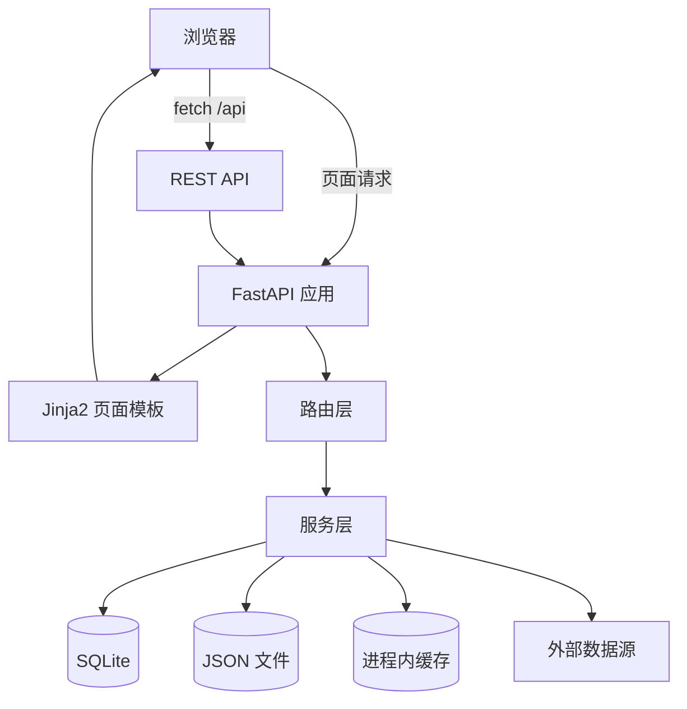
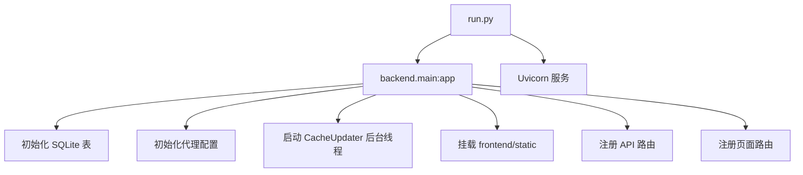
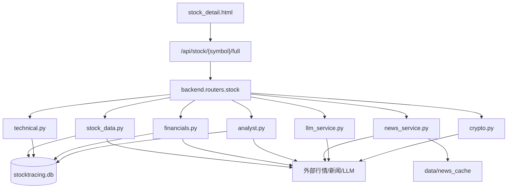
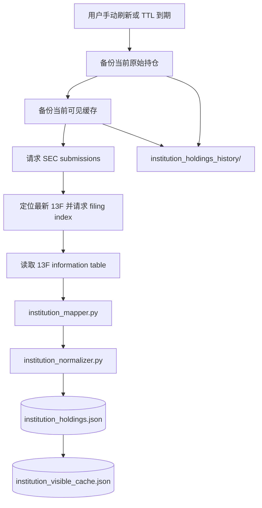
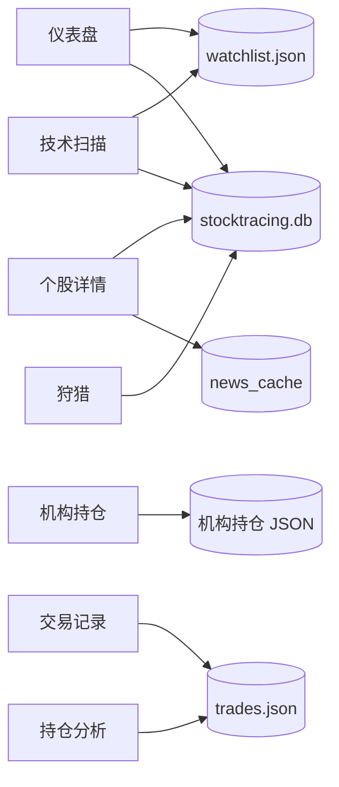

# StockTracing 架构与工作流程

## 总览

StockTracing 是一个本地单体 FastAPI 应用。前端使用 Jinja2 模板，交互通过 `fetch('/api/...')` 调用后端 REST API。数据以 SQLite、JSON 文件和进程内缓存混合存储。



## 核心流程图

### 应用启动流程



### 个股详情数据流



### 机构持仓刷新流程



### 页面与数据存储关系



## 页面结构

| 页面 | 路径 | 模板 | 说明 |
|---|---|---|---|
| 仪表盘 | `/` | `index.html` | 自选股、实时价格、市场时刻表 |
| 个股详情 | `/stock/{symbol}` | `stock_detail.html` | 图表、技术指标、评级、财报、资讯、AI |
| 技术扫描 | `/scan` | `scan.html` | 自选股技术信号矩阵 |
| 狩猎 | `/hunt` | `hunt.html` | 多市场标的扫描和四维评分 |
| 机构持仓 | `/institutions` | `institutions.html` | SEC 13F 机构持仓跟踪 |
| 交易记录 | `/trades` | `trades.html` | 交易 CRUD 和盈亏统计 |
| 持仓分析 | `/portfolio` | `portfolio.html` | 持仓饼图和收益曲线 |

## 后端入口

`run.py` 启动 `backend.main:app`。

`backend/main.py` 负责：

| 步骤 | 说明 |
|---|---|
| 初始化数据库 | `Base.metadata.create_all(bind=engine)` |
| 初始化代理 | `setup_proxy()` |
| 启动缓存线程 | `get_updater().start()` |
| 挂载静态文件 | `/static` |
| 注册 API 路由 | `backend.routers.stock` |
| 注册页面路由 | `backend.routers.pages` |
| 安全 JSON | 过滤 `NaN` / `Infinity` |

## 路由层

`backend/routers/pages.py` 提供页面路由。

`backend/routers/stock.py` 提供主要 REST API：

| API | 说明 |
|---|---|
| `/api/stock/{symbol}` | 股票或加密货币基础信息 |
| `/api/stock/{symbol}/tick` | 实时 tick |
| `/api/stock/{symbol}/history` | 历史 K 线 |
| `/api/stock/{symbol}/technical` | 技术指标 |
| `/api/stock/{symbol}/periods` | D/W/M/Y 周期涨跌和信号 |
| `/api/stock/{symbol}/full` | 个股详情聚合数据 |
| `/api/watchlist` | 自选股管理 |
| `/api/hunt/*` | 狩猎市场、扫描、历史 |
| `/api/institutions` | 机构持仓可见冷缓存 |
| `/api/institutions/{id}` | 单机构完整持仓详情 |
| `/api/institutions/history` | 机构持仓历史列表 |
| `/api/institutions/history/{id}` | 历史快照可见数据 |
| `/api/institutions/warm-mappings` | CUSIP/ticker 映射预热 |
| `/api/trades/*` | 交易记录、统计、持仓分析 |
| `/api/config` | LLM 和代理配置 |

## 服务层

### 股票与行情

`stock_data.py` 负责股票基础信息、估值、实时价格、历史 K 线、A 股代码后缀解析和 tick sparkline。

`cache_updater.py` 是 daemon 后台线程，周期刷新自选股和狩猎队列中的标的，写入 SQLite 和内存 tick 缓存。

### 财报、评级、技术指标

`financials.py` 负责年度/季度利润表、资产负债表和现金流量表。

`analyst.py` 负责目标价、分析师评级、近期评级和调级记录。

`technical.py` 负责 SMA、EMA、MACD、RSI、Bollinger、ATR、OBV、Stochastic，以及 D/W/M/Y 周期涨跌和技术信号。

### 加密货币

`crypto.py` 支持实时行情、OHLCV、D/W/M/Y 周期和技术指标。

数据源回退：

```text
ccxt Binance -> ccxt OKX -> Binance HTTP -> OKX HTTP
```

### AI 与资讯

`llm_service.py` 调用 OpenAI 兼容 API，并用 prompt hash 写入 `llm_cache`。

`news_service.py` 聚合 yfinance 新闻和 DuckDuckGo 搜索结果，缓存到 `data/news_cache/`。

### 狩猎

`discovery.py` 构建市场候选集。

`hunter.py` 按价值、机构、技术、财务四维评分，并写入 `hunt_session` 历史。

### 交易与持仓

`trades.py` 管理交易记录、盈亏统计、持仓合并、领域占比和收益曲线。

交易记录存储在 `data/trades.json`。

## 机构持仓子系统

机构持仓由三个服务协作：

```text
institutions.py
institution_mapper.py
institution_normalizer.py
```

### `institutions.py`

职责：

- 从 SEC EDGAR 拉取最新 13F。
- 8 小时 TTL 自动刷新。
- 刷新前备份当前原始数据和可见冷缓存。
- 生成当前可见冷缓存。
- 提供机构列表、机构详情、历史列表、历史详情。

主要文件：

```text
data/institution_holdings.json
data/institution_visible_cache.json
data/institution_holdings_history/institution_holdings_{snapshot}.json
data/institution_holdings_history/institution_visible_{snapshot}.json
```

### `institution_mapper.py`

职责：

- CUSIP -> ticker 映射。
- issuer name -> ticker 映射。
- ticker -> directory 信息。
- ticker -> sector 缓存。

数据层级：

```text
手工高权重 CUSIP_MAP
SEC company_tickers.json
SEC company_tickers_exchange.json
NASDAQ nasdaqlisted.txt
NASDAQ otherlisted.txt
OpenFIGI CUSIP API
ticker_sector_cache.json
```

缓存文件：

```text
data/cusip_mapping_cache.json
data/sec_ticker_cache.json
data/sec_ticker_exchange_cache.json
data/nasdaq_directory_cache.json
data/ticker_sector_cache.json
```

### `institution_normalizer.py`

职责：

- ticker 清洗。
- issuer 名称归一化。
- CUSIP / ticker / issuer 映射合并。
- PUT/CALL 标记。
- 普通股、ETF、ADR、权证、债券等类型标记。
- 同一 ticker/CUSIP 的多行合并。
- 与历史记录比较增减持。
- 输出前端友好字段。

前端友好字段：

```text
display_symbol
display_name
asset_type
security_type
badge
is_option
sector
trend
```

### 刷新流程

```text
用户点击刷新 / 8h TTL 到期
  ↓
备份 institution_holdings.json
  ↓
备份 institution_visible_cache.json
  ↓
请求 SEC submissions JSON
  ↓
定位最新 13F-HR
  ↓
请求 filing index JSON
  ↓
请求 13F information table XML
  ↓
标准化 CUSIP / ticker / security type
  ↓
写入 institution_holdings.json
  ↓
生成 institution_visible_cache.json
```

### 页面加载流程

首屏：

```text
GET /api/institutions
  ↓
读取 institution_visible_cache.json
  ↓
显示机构横幅、前十资产、全持仓领域占比
```

展开机构：

```text
GET /api/institutions/{id}
  ↓
只标准化并返回该机构完整 holdings
```

历史查看：

```text
GET /api/institutions/history/{snapshot}
  ↓
优先读取 institution_visible_{snapshot}.json
  ↓
缺失时由 institution_holdings_{snapshot}.json 构建一次并回写
```

## 存储层

### SQLite

数据库：`data/stocktracing.db`

| 表 | 作用 |
|---|---|
| `stock_cache` | 股票基础信息、估值、目标价、实时字段 |
| `financial_cache` | 财报缓存 |
| `analysis_cache` | 技术指标、K 线、评级等分析缓存 |
| `llm_cache` | AI 分析缓存和历史 |
| `hunt_session` | 狩猎扫描历史 |

### JSON 文件

| 文件 | 作用 |
|---|---|
| `config.json` | LLM 和代理配置 |
| `watchlist.json` | 自选股 |
| `trades.json` | 交易记录 |
| `institution_holdings.json` | 当前机构持仓数据 |
| `institution_visible_cache.json` | 当前机构持仓首屏冷缓存 |
| `cusip_mapping_cache.json` | CUSIP 映射缓存 |
| `sec_ticker_cache.json` | SEC ticker master 缓存 |
| `sec_ticker_exchange_cache.json` | SEC ticker exchange 缓存 |
| `nasdaq_directory_cache.json` | NASDAQ directory 缓存 |
| `ticker_sector_cache.json` | ticker 行业缓存 |

## 文件列表

```text
StockTracing/
  run.py
    应用启动入口。
    启动 uvicorn，并加载 backend.main:app。

  requirements.txt
    Python 依赖列表。
    覆盖 FastAPI、模板渲染、行情、数据处理、技术指标、LLM 请求等运行依赖。

  README.md
    项目说明文档。
    面向使用者介绍功能、运行方式、配置和注意事项。

  ARCHITECTURE.md
    架构文档。
    说明系统结构、数据流、模块职责、存储设计和文件分布。

  LICENSE
    项目许可证。

  .gitignore
    Git 忽略规则。
    排除缓存、数据库、本地配置和运行产物。

  backend/
    __init__.py
      Python 包标记文件。

    main.py
      FastAPI 应用装配入口。
      初始化数据库、代理、后台缓存线程、静态资源、页面路由和 API 路由。
      定义安全 JSON 响应逻辑，避免 NaN / Infinity 影响响应序列化。

    config.py
      全局配置模块。
      管理 data 目录路径、配置文件路径、代理配置、LLM 配置和默认参数。

    routers/
      __init__.py
        路由包标记文件。

      pages.py
        页面路由模块。
        将 URL 路径映射到 Jinja2 模板。
        覆盖仪表盘、个股详情、技术扫描、狩猎、机构持仓、交易记录和持仓分析页面。

      stock.py
        REST API 主路由模块。
        股票与加密货币：基础信息、tick、历史 K 线、技术指标、周期涨跌、聚合详情。
        自选股：读取、添加、删除和批量管理。
        技术扫描：批量扫描自选标的。
        狩猎：市场列表、扫描任务、历史记录。
        机构持仓：当前列表、单机构详情、历史快照、映射预热。
        交易与持仓：交易 CRUD、统计、组合分析。
        配置：LLM 和代理配置读写。

    services/
      __init__.py
        服务包标记文件。

      stock_data.py
        股票行情服务。
        股票代码解析：处理美股、A 股、港股、日股等不同市场代码。
        基础信息：公司名、行业、市值、估值、股息、Beta 等字段。
        行情数据：实时价格、盘前盘后、历史 K 线、tick sparkline。
        缓存写入：将行情和基础信息写入 SQLite。

      crypto.py
        加密货币行情服务。
        支持主流交易对的实时行情、OHLCV、周期涨跌和技术指标数据准备。
        内置多数据源回退逻辑，并复用项目代理配置。

      technical.py
        技术指标服务。
        指标计算：SMA、EMA、MACD、RSI、Bollinger、ATR、OBV、Stochastic。
        周期分析：D/W/M/Y 涨跌幅和趋势信号。
        扫描输出：为仪表盘、个股详情和技术扫描页提供统一技术面结果。

      financials.py
        财报服务。
        提供利润表、资产负债表、现金流量表。
        支持年度和季度维度，并写入财报缓存。

      analyst.py
        分析师评级服务。
        提供目标价、评级分布、上涨空间、近期评级和调级记录。

      news_service.py
        资讯服务。
        聚合标的相关新闻和搜索结果。
        使用 data/news_cache/ 缓存新闻结果，减少重复请求。

      llm_service.py
        AI 分析服务。
        调用 OpenAI 兼容接口生成中文分析。
        使用 prompt hash 缓存分析结果和历史记录。

      cache_updater.py
        后台缓存刷新服务。
        以 daemon 线程运行。
        周期刷新自选股和狩猎候选队列中的标的。
        维护 SQLite 缓存和进程内 tick 缓存。

      discovery.py
        候选标的发现服务。
        构建不同市场、行业和主题的候选股票池。
        为狩猎扫描提供输入集合。

      hunter.py
        狩猎评分服务。
        从价值、机构、技术、财务四个维度计算评分。
        生成扫描结果，并保存狩猎历史。

      institutions.py
        机构持仓主服务。
        机构列表：维护支持跟踪的机构元数据。
        数据刷新：拉取公开 13F 持仓，处理 TTL、手动刷新和失败回退。
        缓存生成：写入当前原始持仓和首屏可见缓存。
        历史快照：刷新前备份当前数据，支持历史列表和历史详情。
        API 数据组装：为机构列表和单机构展开提供不同粒度的数据。

      institution_mapper.py
        机构持仓映射服务。
        CUSIP 映射：将 13F CUSIP 映射为可展示 ticker。
        名称映射：根据 issuer name 辅助匹配标的。
        Directory 映射：整合 SEC 和交易所目录信息。
        行业映射：维护 ticker 到 sector 的缓存与回退。
        外部兜底：在本地映射不足时调用外部映射服务。

      institution_normalizer.py
        机构持仓标准化服务。
        字段清洗：标准化 ticker、issuer、CUSIP、持仓类型和显示名称。
        类型识别：区分普通股、ETF、ADR、期权、权证、债券等。
        持仓合并：合并同一标的的多行 13F 记录。
        趋势计算：与历史持仓比较，输出增持、减持、新增、清仓等状态。
        前端格式：生成 display_symbol、display_name、badge、sector、trend 等展示字段。

      trades.py
        交易与组合服务。
        交易记录：新增、修改、删除、读取交易。
        盈亏统计：计算已实现盈亏、浮动盈亏、胜率和汇总指标。
        持仓合并：按标的聚合当前仓位、成本、市值和权重。
        组合分析：生成标的占比、领域占比和收益曲线。

    database/
      __init__.py
        数据库包标记文件。

      models.py
        SQLAlchemy 数据模型。
        stock_cache：股票基础信息和实时字段缓存。
        financial_cache：财报缓存。
        analysis_cache：技术分析、K 线和评级等分析缓存。
        llm_cache：AI 分析缓存和历史记录。
        hunt_session：狩猎扫描历史。

    utils/
      __init__.py
        工具包标记文件。

      proxy.py
        代理工具。
        根据配置生成 requests、yfinance、ccxt 等模块可复用的代理参数。

      watchlist.py
        自选股文件工具。
        负责读取、写入和规范化 data/watchlist.json。

  frontend/
    templates/
      base.html
        全局基础模板。
        定义导航栏、页面骨架、公共样式、全局配色和通用前端工具函数。

      index.html
        仪表盘页面。
        展示自选股横条、行情状态、周期涨跌、信号、搜索添加和全屏视图。

      stock_detail.html
        个股详情页面。
        展示行情概览、K 线图、技术指标、评级、财报、资讯和 AI 分析。

      scan.html
        技术扫描页面。
        批量展示自选标的技术信号和扫描结果。

      hunt.html
        狩猎页面。
        提供市场选择、候选扫描、评分结果和历史记录查看。

      institutions.html
        机构持仓页面。
        展示机构横幅、投资规模、前十资产、领域占比和完整持仓明细。
        支持刷新进度、展开详情和历史快照查看。

      trades.html
        交易记录页面。
        提供交易录入、编辑、删除、统计和记录列表展示。

      portfolio.html
        持仓分析页面。
        展示当前组合、标的占比、领域占比、盈亏统计和收益曲线。

  data/
    stocktracing.db
      SQLite 数据库。
      存储行情缓存、财报缓存、分析缓存、AI 缓存和狩猎历史。

    config.json
      本地配置文件。
      存储 LLM、代理等可配置项。

    watchlist.json
      自选股列表。
      存储用户关注的股票和加密货币标的。

    trades.json
      交易记录文件。
      存储用户录入的开仓、平仓和备注信息。

    stock_universe.json
      股票候选池数据。
      为市场发现和狩猎扫描提供基础标的集合。

    exchange_stocks.json
      交易所股票列表缓存。
      为候选集构建和代码解析提供补充数据。

    hunt_groups.json
      狩猎分组配置。
      定义市场、主题或行业分组。

    institution_holdings.json
      当前机构持仓原始聚合数据。
      保存完整机构持仓明细，供详情展开和历史备份使用。

    institution_visible_cache.json
      当前机构持仓首屏可见缓存。
      保存机构横幅、投资规模、前十资产和领域占比等摘要数据。

    cusip_mapping_cache.json
      CUSIP 映射缓存。
      保存已识别的 CUSIP 到 ticker 映射结果。

    sec_ticker_cache.json
      SEC ticker 主目录缓存。
      用于机构持仓标的映射和 ticker 校验。

    sec_ticker_exchange_cache.json
      SEC ticker 交易所目录缓存。
      补充 ticker、交易所、公司名等映射信息。

    nasdaq_directory_cache.json
      NASDAQ directory 缓存。
      用于 ticker 合法性校验和名称匹配。

    ticker_sector_cache.json
      ticker 行业缓存。
      保存 ticker 到 sector 的映射结果。

    news_cache/
      新闻缓存目录。
      按标的保存资讯聚合结果，减少重复请求。

    institution_holdings_history/
      机构持仓历史快照目录。
      institution_holdings_{snapshot}.json：历史原始完整持仓。
      institution_visible_{snapshot}.json：历史首屏可见缓存。

  images/
    GIF *.gif
      README 或演示用途的动态图资源。
```

## 性能策略

- 仪表盘价格使用 tick API 和后台缓存线程。
- 历史 K 线和技术分析使用 SQLite 缓存。
- 机构持仓首屏使用冷缓存，避免进入页面时处理几万条 13F 明细。
- 机构详情按机构懒加载。
- 机构历史优先读取历史冷缓存。
- CUSIP/ticker/sector 映射缓存化，OpenFIGI 和 yfinance 不在首屏路径批量触发。

## 外部依赖风险

| 外部源 | 风险 | 处理 |
|---|---|---|
| Yahoo Finance | 500、限流、HTML 错误页 | 捕获错误、缓存优先、避免非股票符号请求 |
| SEC EDGAR | 请求频率限制 | User-Agent、8h TTL、冷缓存 |
| OpenFIGI | 免费限流 | 批量小请求、本地缓存、失败回退 |
| Binance/OKX | 网络受限 | 代理、双源回退 |
| LLM API | key 缺失或限流 | 可选启用、缓存分析 |

## 后续优化方向

- 机构详情分页或虚拟滚动。
- SEC 刷新后台任务化。
- 机构持仓从 JSON 迁移到 SQLite 表。
- 标准化字段增加 `ticker_source` 和 `sector_source`。
- 映射预热任务队列化。
