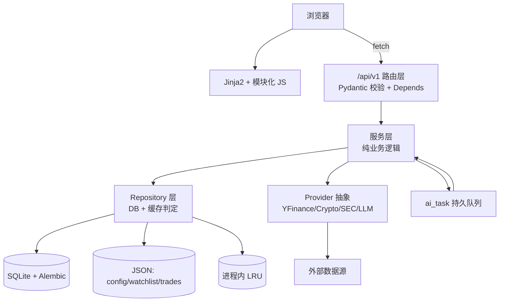

# StockTracing 架构优化设计

> 本文基于对全部源码的逐文件审查，针对现状问题提出系统性优化方案，含设计目标、问题清单、分模块方案、迁移路径与优先级排序。
>
> 配套文档：[ARCHITECTURE.md](ARCHITECTURE.md)（当前架构详述）。

## 1. 设计目标

| 维度 | 目标 |
|---|---|
| **性能** | 仪表盘首屏 < 500ms；tick 链路无外部调用；AI 队列持久化不丢任务 |
| **可维护性** | 消除重复样板（DB session、缓存判定、异常包装）；统一配置与日志 |
| **可扩展性** | 服务解耦，支持异步化；机构持仓迁移 SQLite；API 分层清晰 |
| **可靠性** | 缓存新鲜度统一；外部源故障可降级；任务可观测可重试 |
| **安全性** | 输入校验；API key 全链路脱敏；本地部署边界明确 |
| **可测试性** | 依赖注入；纯函数化技术指标；mock 友好的外部源抽象 |

## 2. 现状问题清单

按严重程度分级（🔴 阻碍 / 🟠 重要 / 🟡 改进）。

### 2.1 数据访问层

| # | 级别 | 问题 | 位置 |
|---|---|---|---|
| D1 | 🔴 | 25 处裸 `SessionLocal()`，无连接池、无上下文管理、无统一关闭 | 全 services |
| D2 | 🔴 | `_is_cache_fresh()` 定义但从未调用，`get_stock_info` 不看 TTL 直接返回旧缓存 | `stock_data.py:11,49` |
| D3 | 🟠 | `technical.py` 在函数内重复 import `AnalysisCache`、`SessionLocal`、`datetime` | `technical.py:44,168` |
| D4 | 🟠 | `trades.py` 在函数内 import `StockCache`，DB session 在 `_compute_pnl_curve` 内手动 `db.close()` 而非 try/finally | `trades.py:25,103,161,222` |
| D5 | 🟡 | 机构持仓用 JSON 文件存储，扩展性差、无查询能力 | `institutions.py` |
| D6 | 🟡 | `Base.metadata.create_all` 在 `models.py:83` 与 `main.py:14` 重复调用 | — |

### 2.2 并发与异步

| # | 级别 | 问题 | 位置 |
|---|---|---|---|
| C1 | 🔴 | 所有路由为同步 `def`，FastAPI 用线程池执行，SQLite `check_same_thread=False` + 多线程写入无锁 | `stock.py` 全部 |
| C2 | 🟠 | `CacheUpdater` 主线程 1s 循环 + 0.5s/标的 sleep，自选 50 只需 25s+ 一轮 | `cache_updater.py:42` |
| C3 | 🟠 | AI 队列进程内 list，重启丢失；无失败重试；无进度观测 | `cache_updater.py:18` |
| C4 | 🟡 | `CacheUpdater` 单例全局，难以测试与替换 | `cache_updater.py:232` |
| C5 | 🟡 | 并发拉取外部源无批量/并发控制，依赖 sleep 粗粒度限速 | 多处 |

### 2.3 缓存策略

| # | 级别 | 问题 | 位置 |
|---|---|---|---|
| K1 | 🔴 | `/full` 聚合接口串行调用 6 个服务，无细粒度缓存优先级，单标的详情页慢 | `stock.py:154` |
| K2 | 🟠 | 缓存 TTL 硬编码散落各处（600/3600/7200/86400/2592000...），无统一配置 | 多处 |
| K3 | 🟠 | 资讯 `get_cached_stock_news` 用 `ignore_ttl=True` 永不判定过期，可能返回极旧数据 | `news_service.py:118` |
| K4 | 🟡 | `analysis_cache` 表用 `(symbol, analysis_type)` 但无唯一约束，可能重复行 | `models.py:52` |
| K5 | 🟡 | 进程内 `_price_info_cache`、`_price_history` 无上限，标的多时内存增长 | `stock_data.py:208` |

### 2.4 外部依赖与容错

| # | 级别 | 问题 | 位置 |
|---|---|---|---|
| E1 | 🟠 | yfinance 调用散落在 6+ 服务，无统一抽象与熔断 | 多处 |
| E2 | 🟠 | `discovery.py` Wikipedia 抓取失败回退内置列表，但内置列表已过期且部分有重复（如 `ZS`、`ZS`、`CTSH`） | `discovery.py:118-127` |
| E3 | 🟡 | `retry_on_rate_limit` 只识别 "rate limit"/"too many requests"，错过 yfinance 常见的 429/503/JSONDecodeError | `config.py:88` |
| E4 | 🟡 | LLM 失败仅返回错误字符串，不落库不重试 | `llm_service.py:144` |
| E5 | 🟡 | 代理仅启动时 `setup_proxy()` 一次，PUT `/config` 后能重置但 yfinance session 已被其他模块持有 | `proxy.py` |

### 2.5 API 与路由

| # | 级别 | 问题 | 位置 |
|---|---|---|---|
| A1 | 🟠 | 路由内混入业务逻辑（如 `_is_crypto`、`_crypto_sym`、`_resolve_sym`、HuntSession 写库） | `stock.py` |
| A2 | 🟠 | 无 Pydantic 请求/响应模型，`body: dict` 无校验 | `stock.py:268,410` |
| A3 | 🟡 | `/api/stock/{symbol}/summary` 默认 `refresh=True`，与 `/summary/latest` 语义易混淆 | `stock.py:140` |
| A4 | 🟡 | `/full` 加密货币分支 analyst/financials/summary/news 全置空，前端需特殊处理 | `stock.py:167` |
| A5 | 🟡 | 无 API 版本前缀，未来变更无兼容空间 | — |

### 2.6 前端

| # | 级别 | 问题 | 位置 |
|---|---|---|---|
| F1 | 🟠 | 单页 JS 内联，`index.html` 591 行、`stock_detail.html` 493 行，难维护 | templates |
| F2 | 🟠 | Tailwind/Chart.js 走 CDN，离线不可用 | `base.html:7-8` |
| F3 | 🟡 | tick 每秒轮询 N 只标的 = N 个请求，无批量接口 | index.html |
| F4 | 🟡 | 无前端构建，无 TS，无组件复用 | — |

### 2.7 安全与配置

| # | 级别 | 问题 | 位置 |
|---|---|---|---|
| S1 | 🟠 | `GET /api/config` 返回脱敏 key，但 `PUT /api/config` 接受 `api_key` 明文写入，无鉴权 | `stock.py:267` |
| S2 | 🟡 | 全局异常把 `str(exc)` 直接返回客户端，可能泄露内部路径 | `main.py:55` |
| S3 | 🟡 | SEC `User-Agent` 硬编码 `contact@example.com` | `institutions.py:20` |
| S4 | 🟡 | 无日志系统，问题难追溯 | — |

### 2.8 遗留与冗余

| # | 级别 | 问题 | 位置 |
|---|---|---|---|
| L1 | 🟡 | `hunt_groups.json`、`stock_universe.json`（`UNIVERSE_FILE`）无代码引用 | data/ |
| L2 | 🟡 | `frontend/static/css`、`frontend/static/js` 空目录 | frontend/ |
| L3 | 🟡 | `discovery.py` 内置列表含重复 ticker（`ZS`×3、`CTSH`×2、`688036.SS`×2 等） | `discovery.py:118-203` |

## 3. 优化方案

### 3.1 数据访问层重构

#### 3.1.1 统一 DB 依赖注入（D1, D3, D4）

引入 FastAPI `Depends` + 上下文管理 session：

```python
# backend/database/deps.py
from typing import Generator
from sqlalchemy.orm import Session

def get_db() -> Generator[Session, None, None]:
    db = SessionLocal()
    try:
        yield db
    finally:
        db.close()
```

路由层：
```python
@router.get("/stock/{symbol}")
def api_stock_info(symbol: str, refresh: bool = False, db: Session = Depends(get_db)):
    return stock_data.get_stock_info(symbol, force_refresh=refresh, db=db)
```

服务层签名统一加 `db: Session` 参数，由上层注入；服务内部不再 `SessionLocal()`。

#### 3.1.2 缓存新鲜度统一（D2, K2, K3）

新增 `backend/config.py` 集中 TTL 配置：

```python
class TTL:
    STOCK_INFO = 3600          # 行情基础
    HISTORY = 600              # K 线
    INDICATORS = 600           # 技术指标
    ANALYST_RATINGS = 3600     # 评级
    NEWS = 7200                # 资讯
    LLM_PROMPT = None          # 永久（按 prompt_hash）
    INSTITUTIONS = 8 * 3600    # 机构持仓
    DISCOVERY = 86400          # 候选集
    MAPPING = 30 * 86400       # 映射
```

引入统一缓存判定 helper：

```python
# backend/services/cache_helpers.py
def is_fresh(updated_at: datetime | None, ttl: int) -> bool:
    if not updated_at or ttl <= 0:
        return False
    age = (datetime.now(timezone.utc) - _aware(updated_at)).total_seconds()
    return age < ttl
```

- `get_stock_info` 改为：缓存存在且 `is_fresh(updated_at, TTL.STOCK_INFO)` 且非 `force_refresh` → 返回缓存；否则拉取并落库。
- 资讯 `get_cached_stock_news` 区分「有缓存但过期」（返回旧值 + `stale=True` 标记）与「无缓存」。

#### 3.1.3 机构持仓迁移 SQLite（D5）

新增 `InstitutionHolding` / `InstitutionSnapshot` 表：

```python
class InstitutionSnapshot(Base):
    __tablename__ = "institution_snapshot"
    id = Column(String(40), primary_key=True)  # 时间戳 ID
    created_at = Column(DateTime, default=lambda: datetime.now(timezone.utc))
    source = Column(String(50))
    metadata_json = Column(JSON)

class InstitutionHolding(Base):
    __tablename__ = "institution_holding"
    id = Column(Integer, primary_key=True, autoincrement=True)
    snapshot_id = Column(String(40), index=True)
    institution_id = Column(String(50), index=True)
    ticker = Column(String(20), index=True)
    cusip = Column(String(20))
    name = Column(String(200))
    sector = Column(String(50))
    shares = Column(Float)
    value = Column(Float)
    change_shares = Column(Float)
    change_value = Column(Float)
    asset_type = Column(String(10))  # SHARE/PUT/CALL
```

- 当前数据 → `snapshot_id="current"`；刷新时新建 snapshot，旧 current 标记为历史。
- 首屏查询 `SELECT institution_id, SUM(value) ... GROUP BY institution_id` 即可，无需 JSON 反序列化。
- 历史快照查询走 SQL，替代文件遍历。
- 保留 JSON 导出能力（备份/迁移）。

#### 3.1.4 表结构约束（K4, D6）

- `analysis_cache` 加 `UniqueConstraint(symbol, analysis_type)`。
- `financial_cache` 加 `UniqueConstraint(symbol, report_type, fiscal_year, fiscal_quarter)`。
- 移除 `models.py` 末尾的 `create_all`，统一由 `main.py` 调用；引入 Alembic 做迁移管理（见 3.7）。

### 3.2 并发与异步化

#### 3.2.1 路由异步化（C1）

将 I/O 密集路由改为 `async def`，外部调用走 `asyncio.to_thread` 或异步客户端：

```python
@router.get("/stock/{symbol}/full")
async def api_full_analysis(symbol: str, refresh: bool = False, db: Session = Depends(get_db)):
    sym = _resolve_sym(symbol)
    # 并发拉取独立数据
    info, history, analyst, financials = await asyncio.gather(
        asyncio.to_thread(get_stock_info, sym, refresh, db),
        asyncio.to_thread(get_stock_history, sym),
        asyncio.to_thread(get_analyst_info, sym, db),
        asyncio.to_thread(get_financials, sym, refresh, db),
        return_exceptions=True,
    )
    ...
```

- `/full` 的 6 个子调用独立 → `asyncio.gather` 并发，详情页耗时从「串行和」降到「最慢一项」。
- SQLite 写入仍走同步线程（`check_same_thread=False` 已支持），后续可换 `aiosqlite`。

#### 3.2.2 CacheUpdater 优化（C2, C4）

**并发刷新**：用 `concurrent.futures.ThreadPoolExecutor(max_workers=4)` 并发拉取，替换 2 个一批的串行循环；保留全局速率限制（信号量）。

**可注入单例**：
```python
class CacheUpdater:
    def __init__(self, interval: int = 30, max_workers: int = 4, stock_repo=None, ...):
        ...
```
通过依赖注入替换为测试 stub。

**配置化间隔**：`interval=1` 过于激进，改为配置项（默认 15-30s），tick 链路靠 `get_tick` 自身缓存兜底。

#### 3.2.3 AI 任务持久化队列（C3, E4）

新增 `ai_task` 表：

```python
class AITask(Base):
    __tablename__ = "ai_task"
    id = Column(Integer, primary_key=True, autoincrement=True)
    symbol = Column(String(20), index=True)
    status = Column(String(20), default="pending")  # pending/running/done/failed
    attempts = Column(Integer, default=0)
    last_error = Column(Text, nullable=True)
    created_at = Column(DateTime, default=lambda: datetime.now(timezone.utc))
    updated_at = Column(DateTime, onupdate=lambda: datetime.now(timezone.utc))
    scheduled_for = Column(DateTime)  # 收盘后调度
```

- 后台线程从 `ai_task WHERE status IN ('pending','failed') AND attempts < 3` 取任务。
- 失败时 `attempts += 1`，指数退避重试。
- 前端可查 `/api/ai/queue` 看进度。
- 重启后任务不丢失。

### 3.3 缓存与性能

#### 3.3.1 `/full` 拆分与分层（K1, A4）

将聚合接口拆为细粒度端点 + 前端并行请求：

```
GET /api/stock/{symbol}/info          (StockCache, < 1ms)
GET /api/stock/{symbol}/history       (AnalysisCache, 10min)
GET /api/stock/{symbol}/technical     (AnalysisCache, 10min)
GET /api/stock/{symbol}/periods
GET /api/stock/{symbol}/analyst       (AnalysisCache, 1h)
GET /api/stock/{symbol}/financials    (FinancialCache)
GET /api/stock/{symbol}/summary/latest (LLMCache, 只读)
```

保留 `/full` 作为兼容聚合（内部并发调用上述），但前端改为并行请求 + 渐进渲染，首屏只需 `info` + `summary/latest`。

**统一加密货币分支**：`/full` 不再为加密货币置空 analyst/financials，而是返回 `{ "supported": false }` 标记，前端按字段渲染。

#### 3.3.2 批量 tick 接口（F3）

```
POST /api/ticks
body: { "symbols": ["AAPL","MSFT",...] }
→ { "ticks": { "AAPL": {...}, "MSFT": {...} } }
```

仪表盘 N 次 `/tick` → 1 次批量，减少 HTTP 开销与连接数。

#### 3.3.3 进程内缓存上限（K5）

`_price_history` 改用 `collections.OrderedDict` + LRU 淘汰，限制 200 标的；`_price_info_cache` 同理。

#### 3.3.4 HTTP 缓存头

对只读缓存接口加 `Cache-Control: max-age=60` + `ETag`（基于 `updated_at`），浏览器复用。

### 3.4 外部源抽象与容错

#### 3.4.1 数据源 Provider 抽象（E1）

```python
# backend/services/providers/base.py
class StockDataProvider(Protocol):
    def get_info(self, symbol: str) -> dict: ...
    def get_history(self, symbol: str, period: str, interval: str) -> list[dict]: ...
    def get_tick(self, symbol: str) -> dict: ...

# backend/services/providers/yfinance_provider.py
class YFinanceProvider:
    @retry_on_rate_limit
    def get_info(self, symbol): ...

# backend/services/providers/crypto_provider.py
class CryptoProvider:
    # ccxt + HTTP 多源
```

服务层依赖 `Provider` 而非直接 `import yfinance`，便于 mock 测试与未来替换数据源。

#### 3.4.2 增强重试（E3）

`retry_on_rate_limit` 扩展识别：
- HTTP 429 / 503 / 502
- `JSONDecodeError`（yfinance HTML 错误页）
- `ConnectionError` / `Timeout`

区分「可重试」与「不可重试」异常，避免对 404 重试。

#### 3.4.3 熔断器（E1）

对 yfinance / SEC / OpenFIGI 引入简单熔断：连续 N 次失败后短路 M 秒，直接返回缓存或空，避免雪崩。

#### 3.4.4 内置列表去重与维护（E2, L3）

`discovery.py` 内置列表去重；建议改为从 `stock_cache` 表动态生成「已成功拉取过的标的」作为兜底，而非硬编码。

### 3.5 API 规范化

#### 3.5.1 Pydantic 模型（A2）

```python
# backend/schemas/trade.py
class TradeCreate(BaseModel):
    symbol: str = Field(..., min_length=1, max_length=20)
    direction: Literal["long", "short"] = "long"
    open_date: str
    open_price: float = Field(..., gt=0)
    quantity: float = Field(..., gt=0)
    close_date: str | None = None
    close_price: float | None = None
    notes: str = ""

class TradeResponse(BaseModel):
    id: str
    symbol: str
    ...
```

路由用 `body: TradeCreate` 替代 `body: dict`，自动校验 + 文档。

#### 3.5.2 业务逻辑下沉（A1）

- `_is_crypto` / `_crypto_sym` / `_resolve_sym` 移到 `services/symbol_resolver.py`。
- HuntSession 写库逻辑移到 `hunter.py` 的 `run_hunt()`，路由只调服务。
- 路由层只做：参数解析 → 调服务 → 返回响应。

#### 3.5.3 API 版本与语义（A3, A5）

- 引入 `/api/v1` 前缀（保留 `/api` 兼容期）。
- `/summary` 默认 `refresh=False`（只读缓存），显式 `?refresh=true` 才生成；`/summary/latest` 废弃，由 `/summary` 默认行为承担。
- 统一错误响应 `{ "detail": "...", "code": "...", "stale": bool }`。

### 3.6 前端优化

#### 3.6.1 资源本地化（F2）

下载 Tailwind / Chart.js 到 `frontend/static/vendor/`，离线可用；或改用轻量替代（如自写 CSS 变量 + Chart.js 单文件）。

#### 3.6.2 JS 模块化（F1）

将各页面内联 JS 抽到 `frontend/static/js/{page}.js`，`base.html` 公共工具抽到 `common.js`。模板只保留初始化调用。无构建步骤仍可用原生 ES Module（`<script type="module">`）。

#### 3.6.3 渐进式迁移（F4，可选）

长期可引入 Vite + Vue/React 单页化，但当前规模下，JS 拆分 + 模块化已能显著改善维护性。建议先用 3.6.2 方案。

### 3.7 工程化

#### 3.7.1 日志系统（S4）

```python
# backend/utils/logger.py
import logging
logger = logging.getLogger("stocktracing")
# 配置文件输出 + 控制台，按级别过滤
```

替换所有 `print`（如有）与静默 `except Exception: pass`，至少 `logger.warning` 记录。

#### 3.7.2 配置中心（S1, S3）

```python
# backend/config.py
class Settings(BaseSettings):
    llm_api_key: str = ""
    llm_model: str = "gpt-4o-mini"
    llm_base_url: str = "https://api.openai.com/v1"
    proxy_enabled: bool = False
    proxy_http: str = ""
    proxy_https: str = ""
    sec_user_agent: str = "StockTracing/1.0 contact@example.com"
    cache_interval: int = 30
    ai_max_workers: int = 1
    class Config:
        env_file = ".env"
        env_prefix = "ST_"
```

- 支持 `.env` 与环境变量，便于容器化。
- `contact@example.com` 改为配置项，启动时若未配置则提示用户填写（SEC 合规要求真实联系方式）。

#### 3.7.3 数据库迁移（D6）

引入 Alembic：
- `alembic init alembic`
- 首个 migration 对应当前 schema
- 后续表结构变更走 migration，不再 `create_all`

#### 3.7.4 测试骨架

```
tests/
├── conftest.py            # pytest fixtures: in-memory SQLite, mock provider
├── test_technical.py      # 纯函数指标计算
├── test_institution_normalizer.py
├── test_stock_data.py     # mock YFinanceProvider
├── test_api.py            # TestClient
└── test_cache.py
```

优先覆盖：`technical._generate_signals`、`institution_normalizer.normalize_holdings`、`trades` 盈亏计算、`hunter.score_stock`。

#### 3.7.5 安全（S1, S2）

- `PUT /api/config` 写 `api_key` 时，若值为脱敏格式（含 `****`）则忽略，避免前端回写脱敏值覆盖真值。
- 全局异常 handler 生产模式隐藏 `detail`，仅返回错误 code；开发模式（env 控制）保留。
- 文档明确「仅供本地使用」，不建议暴露公网；如需远程访问加 Basic Auth 或 token。

### 3.8 遗留清理（L1, L2, L3）

- 删除 `data/hunt_groups.json`、`data/stock_universe.json`、`hunter.py` 的 `UNIVERSE_FILE`。
- 删除 `frontend/static/css`、`frontend/static/js` 空目录，或迁入 3.6.2 拆出的 JS。
- `discovery.py` 内置列表去重。

## 4. 目标架构



**关键变化**：
1. 路由层薄化，业务下沉服务层
2. 新增 Repository 层统一 DB + 缓存
3. 外部源经 Provider 抽象，可 mock/熔断
4. AI 任务持久化，重启不丢
5. 机构持仓入 SQLite

## 5. 迁移路径

按优先级分 4 期，每期可独立交付。

### 第 1 期：基础治理（1-2 天，低风险）

**目标**：清理遗留、统一缓存判定、修明显 bug。

- [ ] L1 删除遗留文件与 `UNIVERSE_FILE`
- [ ] L2 清理空目录
- [ ] L3 `discovery.py` 去重
- [ ] D2 `get_stock_info` 接入 `is_fresh`
- [ ] D6 移除 `models.py` 重复 `create_all`
- [ ] D3 `technical.py` 清理函数内 import
- [ ] K3 资讯 stale 标记
- [ ] S4 引入 logger，替换静默 except
- [ ] E3 增强重试识别

### 第 2 期：数据层重构（3-5 天，中风险）

**目标**：DB 依赖注入、TTL 统一、表约束。

- [ ] D1 引入 `get_db` Depends，服务层签名改造
- [ ] D4 `trades.py` session 改 try/finally
- [ ] K2 TTL 集中配置
- [ ] K4 表加唯一约束
- [ ] S3 SEC UA 配置化
- [ ] 3.7.3 引入 Alembic
- [ ] 3.7.4 测试骨架 + 核心纯函数测试

### 第 3 期：性能与并发（3-5 天，中高风险）

**目标**：异步化、`/full` 拆分、AI 持久队列、批量 tick。

- [ ] C1 路由异步化（先 `/full`、`/tick`）
- [ ] K1 `/full` 拆分 + 前端并行
- [ ] F3 批量 tick 接口
- [ ] C3 `ai_task` 表 + 持久队列
- [ ] C2 `CacheUpdater` 并发刷新 + 配置间隔
- [ ] C4 `CacheUpdater` 可注入
- [ ] E1 Provider 抽象（先 yfinance）
- [ ] K5 进程内 LRU 上限
- [ ] 3.3.4 HTTP 缓存头

### 第 4 期：架构演进（5-7 天，高风险）

**目标**：机构持仓入库、API 规范化、前端模块化、熔断。

- [ ] D5 机构持仓迁移 SQLite + 数据迁移脚本
- [ ] A1 业务逻辑下沉
- [ ] A2 Pydantic 模型
- [ ] A3/A5 API 版本与语义统一
- [ ] E4 LLM 失败重试
- [ ] E1 熔断器
- [ ] F2 资源本地化
- [ ] F1 JS 模块化
- [ ] S1/S2 安全加固
- [ ] 3.7.2 Settings 配置中心

## 6. 风险与回滚

| 风险 | 应对 |
|---|---|
| 异步化引入并发 bug | 分批迁移，先只读接口；SQLite 写入仍同步；加测试 |
| 机构持仓迁移丢数据 | 保留 JSON 导出；迁移脚本可重跑；新旧并行期双写 |
| Provider 抽象改动面大 | 渐进式，先包一层适配器，旧代码继续调 yfinance，新代码走 Provider |
| 前端拆分破坏现有交互 | 逐页迁移，保留内联作为 fallback；diff 对比行为 |
| Alembic 迁移失败 | 首个 migration 与 `create_all` 结果一致；保留 `create_all` 作应急 |

## 7. 度量指标

落地后应观测：

| 指标 | 现状估计 | 目标 |
|---|---|---|
| 仪表盘首屏（50 自选） | 串行拉取 ~25s+ 后台补全 | 骨架 < 200ms，缓存填充 < 1s |
| 个股详情 `/full` | 串行 6 服务 ~3-8s | 并发 < 1.5s |
| tick 链路 | 进程内缓存命中 < 5ms | 保持 < 5ms，批量接口减请求数 |
| AI 任务丢失 | 重启全丢 | 0 丢失，失败可重试 |
| 测试覆盖 | 0% | 核心纯函数 > 80%，API smoke test |
| 外部源故障恢复 | 静默失败 | 熔断 + 降级 + 日志可观测 |

---

*本文档为优化设计提案，实施前建议逐期评审与测试。*
